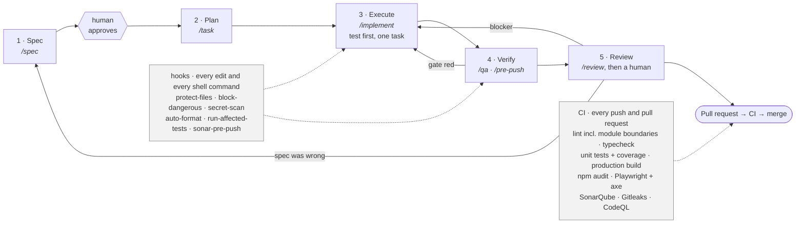

<div align="center">

# Agentic Angular Boilerplate

**An Angular 21 + Nx + PrimeNG front end that ships with its own engineering guardrails.**

[](https://angular.dev/)
[](https://nx.dev/)
[](https://primeng.org/)
[](https://www.typescriptlang.org/)
[](https://playwright.dev/)
[](#licence)

</div>

---

## What this is

Most Angular "starter templates" give you a folder structure and leave the hard parts — library
boundaries that actually hold, an API contract the client can trust, accessible components, a
quality gate that blocks bad merges — as an exercise. This one ships those parts working, with a
single sample feature proving the whole path end to end.

It is also built to be driven by [Claude Code](https://claude.com/claude-code). A `.claude/`
harness ships **committed, not gitignored**: hooks that format on save, block dangerous shell
commands, protect generated and sensitive files, run the affected tests, scan for secrets, and
gate a push on the quality gate — plus slash commands for the recurring work.

It contains **no business domain**. The one sample feature, `libs/feature-items`, is designed to
be deleted once you have copied its shape.

It **consumes** an API it does not own: TypeScript types are generated from that API's OpenAPI
document, and the app never hand-writes a server type. The reference implementation of the API
lives in a [sibling repository](#related-repositories).

## What you get

- **An Nx workspace with enforced boundaries** — `app → feature → shell/auth → data-access →
  shared/util`, declared as `scope:*` tags and enforced by `@nx/enforce-module-boundaries`.
  Breaking the direction fails lint, not code review.
- **Angular 21 the modern way** — standalone components, signals, `OnPush`, `inject()`, strict
  TypeScript with no `any`, lazy routes, and an SSR-capable build that ships as a static bundle
  in production.
- **PrimeNG as the only component library** — a themed preset, design tokens in one file, and a
  ban on native form controls so the app cannot drift into two visual languages.
- **OpenAPI as the contract** — `libs/data-access/api-types` is *generated* by
  `npm run generate:api`. Hand-written DTOs on the client are a bug.
- **One place that talks HTTP** — `libs/data-access/api-client` owns the interceptors: bearer
  tokens, the `ApiResponse<T>` envelope unwrapped centrally, and `ApiError` for everything that
  fails. Feature code never touches `.data`.
- **The hard client-side flows already handled** — 401 session expiry, 403 access-denied
  routing, 404, and the **409 stale-`rowVersion` conflict**, which the sample feature implements
  end to end rather than describing.
- **Offline demo mode** — `--configuration=demo` runs the whole app against MSW handlers with a
  built-in role picker. No API, no identity provider, no network.
- **Tests that mean something** — Vitest + Testing Library for logic and components, Playwright
  journeys, and an `@axe-core/playwright` accessibility gate on critical routes.
- **A real quality gate** — lint including module boundaries, typecheck, unit tests with
  coverage, a production build, `npm audit`, Playwright, SonarQube (zero new
  Blocker/Critical/Major, ≥80% coverage on new code), Gitleaks, and CodeQL.
- **The agentic harness** — 8 hooks and the `/spec`, `/task`, `/implement`, `/qa`, `/review`,
  `/pre-push`, `/quality-gate`, `/sync` commands, all committed.
- **A written process** — a [five-stage workflow](docs/workflow.md), a
  [Definition of Done](docs/definition-of-done.md), a [spec template](docs/specs/TEMPLATE.md),
  a [Day-1 checklist](docs/onboarding.md), and an
  [architecture guide](docs/architecture.md) that walks every library: what may and may not live
  there, what it depends on, a real example from the sample slice, and the mistake newcomers
  make with it.

What it is **not**: a design system, an auth server, or a deployment you can apply as-is. The
`Dockerfile`, `nginx.conf`, and `docker/40-env.sh` are a reviewed static-hosting setup with no
real hostnames in them — you supply those at deploy time.

## Quickstart (about two minutes)

**Prerequisites:** Node.js 22+ and npm. Nothing else — the demo mode needs no API.

```bash
# 1 — clone
git clone https://github.com/Emadkhanqai/aj-boilerplate-fe.git
cd aj-boilerplate-fe

# 2 — install from the committed lockfile
npm ci

# 3 — run it offline against MSW mocks  →  http://localhost:4200
npx nx serve web --configuration=demo
```

Open <http://localhost:4200>. The `demo` configuration renders a role picker instead of a real
identity provider — pick any of the sample users, then go to **Items** and create, edit, and
delete a row. That round trip exercises the feature library, the generated API types, the HTTP
client, the envelope interceptor, the guards, and the optimistic-concurrency flow.

### Pointing it at a real API instead

```bash
npx nx serve web
```

The app calls relative `/api/v1/...` paths, so proxy `/api` to your API — `nginx.conf` is the
container equivalent, and `apps/web/public/env.js` (populated at runtime by `docker/40-env.sh`)
is where the OIDC client id, authority, and scope arrive. Then regenerate the types against your
own contract:

```bash
npm run generate:api      # edit the URL in package.json first
```

Verify the gate is green before you change anything:

```bash
npx nx run-many -t lint --all
npx nx run-many -t test --all
npx nx build web
npx nx e2e web-e2e
```

Full command reference: [CLAUDE.md](CLAUDE.md).

## Repository map

```
.
├── CLAUDE.md              project context for Claude Code — read this first
├── DESIGN.md              the visual contract — read before any UI work
├── .claude/               committed agentic harness: hooks, commands, standards, agents
├── .mcp.json              MCP server configuration
├── apps/
│   ├── web/               the application: bootstrap, routes, design CSS, MSW mocks, auth pages
│   └── web-e2e/           Playwright journeys + the axe-core accessibility gate
├── libs/
│   ├── auth/                    session, route guards, role -> capability map
│   ├── data-access/api-types/   GENERATED from OpenAPI — never hand-edited
│   ├── data-access/api-client/  the only code that talks HTTP
│   ├── shared/ui/               presentational components
│   ├── shared/util/             formatters and helpers
│   ├── shell/                   sidebar, top bar, layout, nav config
│   └── feature-items/           the sample feature — copy its shape, then delete it
├── docs/
│   ├── adr/               architecture decision records (+ template)
│   ├── specs/             feature specs (+ template)
│   ├── api/               the API this app consumes, and how its types are generated
│   ├── handoff/           session handoffs written by the Stop hook
│   ├── architecture.md    every library, and why each boundary exists
│   ├── onboarding.md      Day-1 checklist
│   ├── workflow.md        Spec → Plan → Execute → Verify → Review, with diagrams
│   └── definition-of-done.md
├── .github/
│   ├── workflows/         the CI pipeline: lint, typecheck, tests, build, audit, E2E, Sonar,
│   │                      Gitleaks, CodeQL
│   └── gitleaks.toml      secret-scanning config; extends the default ruleset
├── Dockerfile             static SPA build served by nginx
├── nginx.conf             same-origin `/api` proxy for the container
└── docker/40-env.sh       injects runtime configuration into public/env.js at container start
```

## How work flows here

Every change — a bug fix, a feature, a refactor — moves through the same five stages, and the
same gates. The solid path is what you do; the shaded gates fire whether or not anyone remembers
them.



The distinction matters more than the stages do. The standards, commands, and agents in
`.claude/` are **prose** — an agent reads them, usually follows them, and occasionally does not.
The hooks, the permission policy, the Nx boundary rules, and CI are **deterministic**: they fire
every time, identically, and a `PreToolUse` hook can refuse a tool call before it happens. That
is why a rule worth enforcing lives in a hook rather than only in a document.

The full picture — every stage, every hook, which agent does what, and one small feature followed
through all five stages with real commands — is in **[docs/workflow.md](docs/workflow.md)**.

## Related repositories

The same boilerplate is published in three shapes. Pick the one that matches your project — the
single-stack repos are derived from the full-stack one, not forks that drift.

| Repository | Contents |
|---|---|
| [`aj-boilerplate-fe`](https://github.com/Emadkhanqai/aj-boilerplate-fe) | **This repo** — the Angular front end, promoted to the repository root |
| [`aj-boilerplate-be`](https://github.com/Emadkhanqai/aj-boilerplate-be) | The API this app consumes, promoted to the repository root |
| [`aj-boilerplate-fs`](https://github.com/Emadkhanqai/aj-boilerplate-fs) | Both stacks in one tree, plus infrastructure |

All three share `.claude/`, `docs/`, `.gitignore`, and `.editorconfig`. See
[ADR-0004](docs/adr/0004-three-repository-split.md) for why.

## CI configuration

The workflow in [`.github/workflows/frontend-ci.yml`](.github/workflows/frontend-ci.yml) needs
the following repository settings. They are **not** included, and the SonarQube job skips itself
until you provide them.

**Repository variables** (*Settings → Secrets and variables → Actions → Variables*)

| Variable | Purpose |
|---|---|
| `SONAR_HOST_URL` | Your SonarQube server URL. The quality-gate job skips itself while this is unset. |
| `SONAR_PROJECT_KEY` | The project key on that server |

**Repository secrets**

| Secret | Purpose |
|---|---|
| `SONAR_TOKEN` | SonarQube analysis token |
| `GITLEAKS_LICENSE` | Optional. Only needed for organisation-owned **private** repositories; Gitleaks is free on public ones. |

SonarQube here is the free **Community Build**: it analyses the default branch only, so the
quality gate runs on pushes to `main` and there is no pull-request decoration. Pull requests are
gated by everything else in the pipeline plus the local `sonar-pre-push` hook. See
[`.claude/standards/sonarqube.md`](.claude/standards/sonarqube.md).

## Contributing

Read [docs/workflow.md](docs/workflow.md) and
[docs/definition-of-done.md](docs/definition-of-done.md) before opening a pull request, and
[docs/architecture.md](docs/architecture.md) before your first change. In short: spec first,
failing test first, keep the diff small, green gate, and a human reviews every change —
including the ones an agent wrote.

## Licence

**No licence is set yet.** Until a `LICENSE` file is added, default copyright applies and no
reuse rights are granted. The repository owner should choose a licence and commit the
corresponding `LICENSE` file, carrying the appropriate copyright line.

`package.json` therefore declares `"license": "UNLICENSED"` deliberately — it matches the state
above, and it stops npm tooling from implying a permission that has not been granted. Change
both together when you pick a licence.
