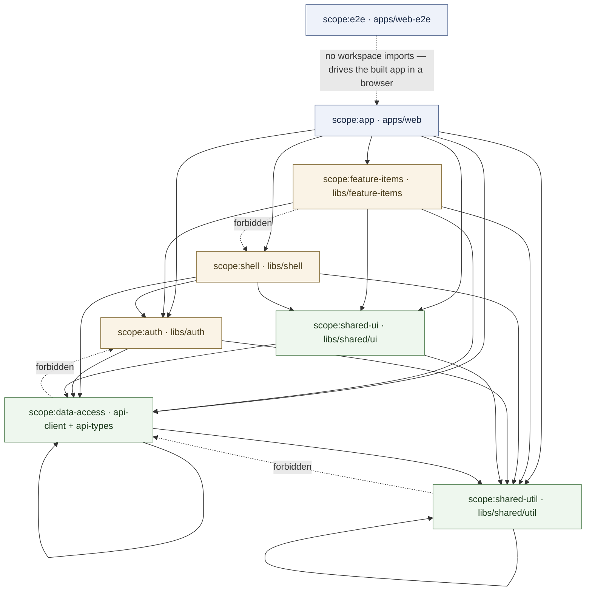
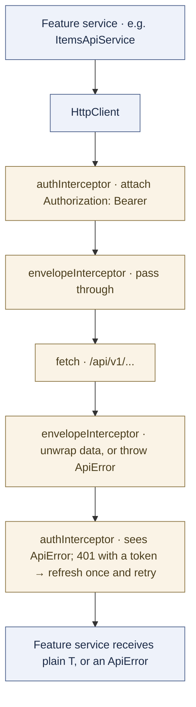
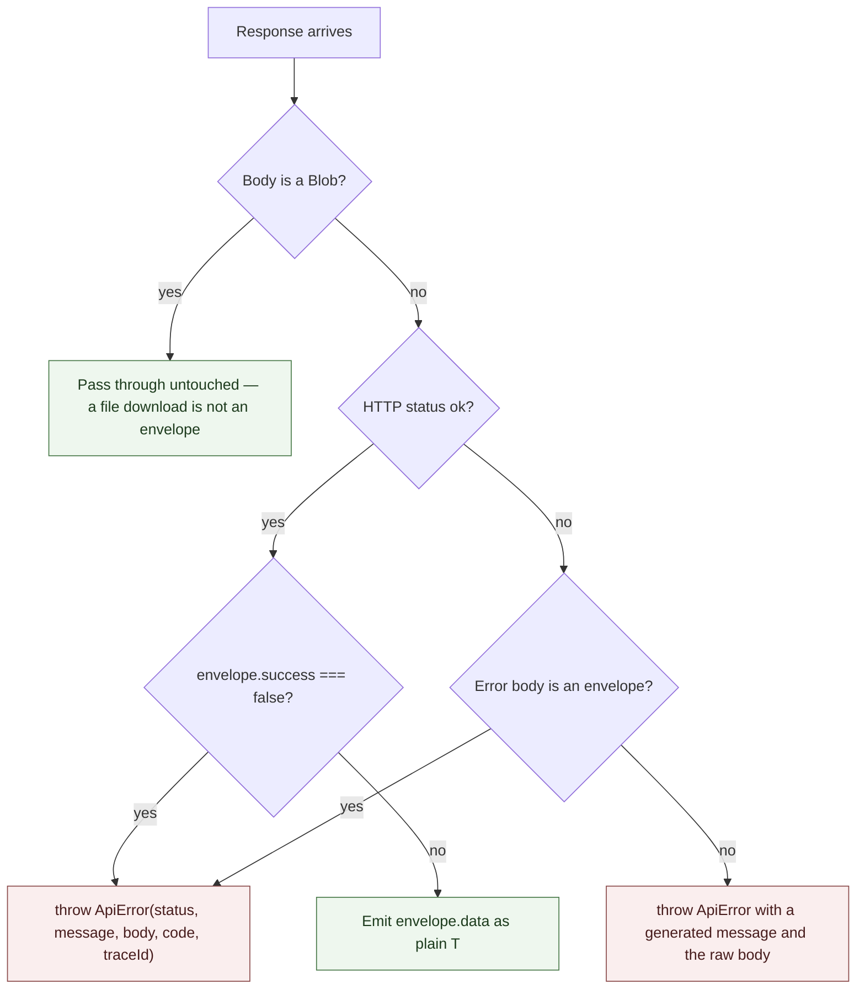
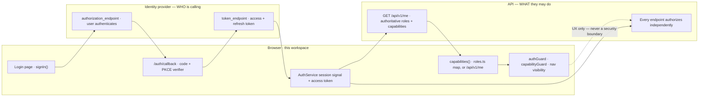
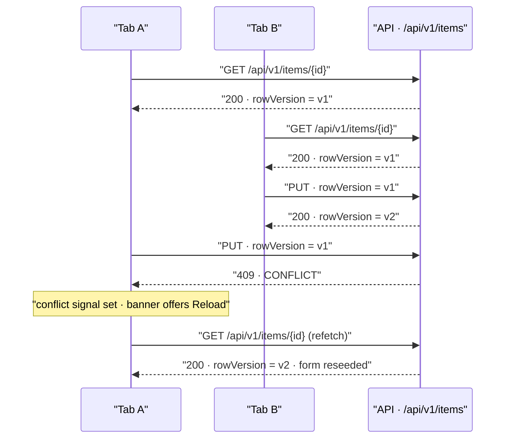
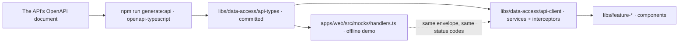

# Architecture

A library-by-library tour of the workspace, written for someone who cloned it ten minutes ago.

Every project below is described the same way: **what it is for**, **what may live there**, **what
may not**, **what it depends on**, **a concrete example from the sample `Item` slice with real file
paths**, and **the mistake newcomers actually make** with it.

The short version: this is an Nx workspace whose import direction runs one way — `app → feature →
shared` — and that direction is a lint error rather than a convention. Everything that speaks HTTP
lives behind one library, everything the UI gates on derives from one capability map, and the sample
feature exists to be read once and then deleted.

**Contents**

- [The workspace](#the-workspace) - [The library boundary rule](#the-library-boundary-rule) -
  [`apps/web`](#appsweb) - [`apps/web-e2e`](#appsweb-e2e) -
  [`libs/data-access/api-types`](#libsdata-accessapi-types) -
  [`libs/data-access/api-client`](#libsdata-accessapi-client) - [`libs/auth`](#libsauth) -
  [`libs/shared/util`](#libssharedutil) - [`libs/shared/ui`](#libssharedui) -
  [`libs/shell`](#libsshell) - [`libs/feature-items`](#libsfeature-items)
- [Why these boundaries exist](#why-these-boundaries-exist) - [Why `data-access` must not import
  `auth`](#why-data-access-must-not-import-auth) - [Why `api-types` is generated and never
  hand-written](#why-api-types-is-generated-and-never-hand-written) - [Why the envelope is unwrapped
  in exactly one place](#why-the-envelope-is-unwrapped-in-exactly-one-place) - [Why a feature
  library may never import another feature](#why-a-feature-library-may-never-import-another-feature)
- [Cross-cutting machinery](#cross-cutting-machinery) - [The HTTP interceptor
  chain](#the-http-interceptor-chain) - [How a failed response becomes an
  `ApiError`](#how-a-failed-response-becomes-an-apierror) - [The response
  envelope](#the-response-envelope) - [Correlation ids](#correlation-ids) - [Server state, caching,
  and the global error toast](#server-state-caching-and-the-global-error-toast) - [Where
  authentication ends and authorization begins](#where-authentication-ends-and-authorization-begins)
  - [Optimistic concurrency](#optimistic-concurrency) - [Surviving a deploy](#surviving-a-deploy)
- [The seam with the API](#the-seam-with-the-api)
- [Deleting the sample slice](#deleting-the-sample-slice)
- [Where to look next](#where-to-look-next)

---

## The workspace

The Nx workspace *is* the repository. `package.json`, `nx.json`, `tsconfig.base.json`, and
`eslint.config.mjs` sit at the root, with two applications and seven libraries beneath them:

```
package.json  nx.json  tsconfig.base.json  eslint.config.mjs
apps/
├── web/          the Angular application: bootstrap, routes, public pages, design tokens, mocks
└── web-e2e/      Playwright journeys and axe-core accessibility scans
libs/
├── auth/                    session, guards, role → capability map
├── data-access/api-types/   GENERATED from the API's OpenAPI document
├── data-access/api-client/  the only place that talks HTTP
├── shared/ui/               presentational components with no feature knowledge
├── shared/util/             framework-light helpers, no UI, no HTTP
├── shell/                   the authenticated chrome
└── feature-items/           THE SAMPLE FEATURE
```

Libraries are consumed through the path aliases declared in `tsconfig.base.json` —
`@aj-boilerplate/auth`, `@aj-boilerplate/data-access/api-client`, `@aj-boilerplate/shared/ui`, and
so on. A relative import that reaches up out of a library into another one bypasses the alias and
therefore bypasses the boundary check; it is always a mistake.

The house rules that apply everywhere, so they are stated once here rather than repeated in each
section (the full list lives in [`CLAUDE.md`](../CLAUDE.md)):

- **Standalone components, signals, `OnPush`, `inject()`.** No NgModules, no constructor injection,
  no `ChangeDetectionStrategy.Default`.
- **Strict TypeScript. No `any`**, not in tests and not "temporarily" — use `unknown` and narrow it.
- **PrimeNG is the only component library.** No bare `<button>`, `<input>`, `<select>`,
  `<textarea>`, or hand-rolled `<table>` in a template. Dropdowns are searchable and A–Z sorted
  (`sortByLabel`) by default.
- **Server state is TanStack Query; local UI state is signals.** No global mutable stores.
- **Versioned endpoints only** — `/api/v1/...`.
- **Every data view handles loading, error, empty, and success.** All four, always.

The commands that matter:

```bash
npm install
npx nx serve web                      # dev server against a real API
npx nx serve web --configuration=demo # offline: MSW-mocked API, no API needed
npx nx build web                      # production build
npx nx run-many -t lint --all         # lint, including the module-boundary rules
npx nx run-many -t test --all         # unit tests (Vitest)
npx nx e2e web-e2e                    # Playwright + axe (boots the demo build itself)
npm run generate:api                  # regenerate API types from the OpenAPI document
```

### The library boundary rule

This is the rule that shapes the most code in the workspace, so it comes first.

Each project carries a `scope:*` tag in its `project.json`:

| Project | Path | Tag |
|---|---|---|
| `web` | `apps/web/project.json` | `scope:app` |
| `web-e2e` | `apps/web-e2e/project.json` | `scope:e2e` |
| `shell` | `libs/shell/project.json` | `scope:shell` |
| `feature-items` | `libs/feature-items/project.json` | `scope:feature-items` |
| `auth` | `libs/auth/project.json` | `scope:auth` |
| `api-client` | `libs/data-access/api-client/project.json` | `scope:data-access` |
| `api-types` | `libs/data-access/api-types/project.json` | `scope:data-access` |
| `ui` | `libs/shared/ui/project.json` | `scope:shared-ui` |
| `util` | `libs/shared/util/project.json` | `scope:shared-util` |

`eslint.config.mjs` then declares, per scope, which scopes it may import from, via
`@nx/enforce-module-boundaries`. Violating it is a **lint error**, not a review comment. These are
the constraints exactly as they ship:

| `sourceTag` | `onlyDependOnLibsWithTags` |
|---|---|
| `scope:app` | `scope:data-access`, `scope:shared-ui`, `scope:shared-util`, `scope:auth`, `scope:shell`, `scope:feature-items` |
| `scope:feature-items` | `scope:data-access`, `scope:shared-ui`, `scope:shared-util`, `scope:auth` |
| `scope:shell` | `scope:data-access`, `scope:shared-ui`, `scope:shared-util`, `scope:auth` |
| `scope:auth` | `scope:data-access`, `scope:shared-util` |
| `scope:data-access` | `scope:data-access`, `scope:shared-util` |
| `scope:shared-ui` | `scope:data-access`, `scope:shared-util` |
| `scope:shared-util` | `scope:shared-util` |

Drawn out, with an arrow meaning "may import from" and anything not drawn being forbidden:



Read off the shape:

- **Nothing points upward.** No library imports `apps/web`, and nothing imports a feature except the
  app that routes to it.
- **Features never point at each other.** If two features need the same thing, it moves to
  `shared/*` — it does not get imported sideways.
- **`shared/util` may depend only on `shared/util`.** That self-edge is what makes it the safe
  bottom of the graph: adding a helper there can never drag a dependency into a consumer.
- **`scope:data-access` may depend on `scope:data-access`.** That self-edge is load-bearing too — it
  is how `api-client` imports `api-types`, which is the only intra-scope edge in the workspace.
- **`shared/ui` may reach `data-access`,** and does: `QUERY_CLIENT` builds the shared TanStack
  `QueryClient` and needs `apiErrorMessage` and `isSessionExpiredError` from the API client to
  decide what an error toast should say.
- **`scope:e2e` has no entry at all,** and needs none. `apps/web-e2e` imports nothing from the
  workspace; it drives the built application through a real browser. The dotted edge above is a
  runtime relationship, not an import.

The two other dotted edges are illustrative of the direction that is forbidden, and each has a
section explaining why: [a feature may not reach into the
shell](#why-a-feature-library-may-never-import-another-feature), and [`data-access` may not import
`auth`](#why-data-access-must-not-import-auth).

`enforceBuildableLibDependency: true` is set alongside the constraints, so a buildable library can
never quietly take a dependency on a non-buildable one and break the moment it is built in
isolation.

When you add a feature library, its `scope:feature-*` tag goes in **two** places in
`eslint.config.mjs` — `scope:app`'s `onlyDependOnLibsWithTags` (so the app may route to it) and its
own entry listing the shared scopes it may consume. The file's header comment says exactly this.
Four more steps complete the wiring: the tag in the new `project.json`, the path alias in
`tsconfig.base.json`, a lazy route in `apps/web/src/app/app.routes.ts`, and a nav entry in
`libs/shell/src/lib/nav-config.ts`. `libs/feature-items` is the worked example of all five.

---

### `apps/web`

**Single responsibility.** Be the composition root: routes, providers, public pages, and the design
tokens. It contains almost no logic.

**May live here**

- `apps/web/src/app/app.config.ts` — the provider list, and the only place the DI seams are bound
- `apps/web/src/app/app.routes.ts` — routing, and `apps/web/src/app/app.routes.server.ts` /
  `apps/web/src/app/app.config.server.ts` for the server-render configuration
- `apps/web/src/app/app.ts` and `apps/web/src/app/app.html` — the root component, which mounts the
  single app-wide `<p-toast>`
- `apps/web/src/app/pages/` — the pages that render *outside* the authenticated shell: `login-page`,
  `auth-callback-page`, `signing-out-page`, `access-denied-page`, `not-found-page`, plus the
  authenticated landing page `home-page`
- `apps/web/src/design/tokens.css` and `apps/web/src/design/components.css`, plus
  `apps/web/src/styles/app-preset.ts` (the PrimeNG theme preset) — the only three places a visual
  value may live, per [`DESIGN.md`](../DESIGN.md)
- `apps/web/src/environments/environment.ts` and `apps/web/src/environments/environment.demo.ts`
- `apps/web/src/mocks/handlers.ts` and `apps/web/src/mocks/browser.ts` — the MSW mock API for the
  offline `demo` build
- `apps/web/public/env.js` — runtime configuration (auth mode, OIDC settings) rewritten per
  deployment by `docker/40-env.sh`, so one built artifact can be promoted across environments
  without a rebuild

**May not live here**

- Feature logic. That belongs in a `libs/feature-*` library, where the boundary rule applies to it
- Anything a second application would need
- A real secret. `apps/web/src/environments/*` and `apps/web/public/env.js` hold placeholders only

**Depends on.** Every library, per the `scope:app` constraint. It is the only project allowed to see
them all, which is what makes it the composition root.

**In the sample slice.** `apps/web/src/app/app.routes.ts` shows the routing shape to copy: the
public routes first, then one guarded group with `canActivate: [authGuard]` rendering into
`AppLayoutComponent`. The landing route is deliberately **eager** — it is what every authenticated
user's first paint renders, so code-splitting it would only add a network round trip — and every
feature route is lazy via `loadComponent`. `items/new` and `items/:id` add
`capabilityGuard('canCreate')` and `capabilityGuard('canEdit')` on top of the group's `authGuard`.

`apps/web/src/app/app.config.ts` is where three separate decisions are made, all of them worth
reading before you change any of them:

- **Preloading.** `provideRouter(appRoutes, withPreloading(PreloadAllModules))` — every
  `loadComponent` route still splits out of the initial bundle, but once the first render is done
  the router fetches the rest in the background, so the first actual navigation is instant.
- **Interceptor order.** `withInterceptors([authInterceptor, envelopeInterceptor])`, in that order,
  with a comment saying so. See [the interceptor chain](#the-http-interceptor-chain).
- **The three DI seams** — `AUTH_TOKEN_PROVIDER`, `TOKEN_REFRESHER`, `SESSION_EXPIRED_NOTIFIER` —
  each bound to an `AuthService` method through a factory. This is how `data-access` handles auth
  without importing `libs/auth`, which the boundary rule forbids.

`apps/web/src/main.ts` calls `environment.maybeStartMockWorker()` before `bootstrapApplication`, and
the `demo` build configuration swaps the whole `environment.ts` module for `environment.demo.ts` via
`fileReplacements` (`apps/web/project.json`). The comment in
`apps/web/src/environments/environment.ts` records why the swap is a *file* replacement rather than
a runtime `if`: a boolean-guarded dynamic import does not remove the imported module graph from a
production bundle — the MSW chunk was verified to ship in `production` output, just unexecuted —
whereas replacing the module means the production build never references `../mocks/browser` at all.

**The common mistake.** Growing a page component in `apps/web/src/app/pages/` until it is a feature.
Once it fetches data or owns a workflow, it belongs in a library where the boundary rule applies to
it. The second is putting a colour or a spacing value in a component: the three design files above
are the only places those may live, and a hard-coded value is a bug rather than a shortcut.

---

### `apps/web-e2e`

**Single responsibility.** Prove the critical journeys still work in a real browser, and that the
critical routes are accessible.

**May live here.** Playwright journeys (`apps/web-e2e/src/journeys/`), axe scans
(`apps/web-e2e/src/accessibility/`), and shared fixtures (`apps/web-e2e/src/fixtures/`).

**May not live here.** Anything the application imports. It is a leaf, and its `scope:e2e` tag
appears in no `depConstraints` entry precisely because it consumes nothing from the workspace.

**Depends on.** Nothing in the workspace. It declares `"implicitDependencies": ["web"]` so Nx knows
to rebuild the app when the e2e project's affected set is computed, and drives the served
application over HTTP.

**In the sample slice.** `apps/web-e2e/src/journeys/items-crud.spec.ts` walks list → create → edit →
delete using role-based locators and `data-testid` hooks, never CSS selectors, and with no
`waitForTimeout`. `apps/web-e2e/src/accessibility/critical-routes.spec.ts` scans the login page, the
authenticated shell, and a page with real form controls, with `wcag2a` and `wcag2aa` tags and **no
rules disabled** — the file's comment is explicit that an exclusion nobody can find is the same as
no test.

Two fixtures carry most of the determinism:

- `apps/web-e2e/src/fixtures/auth.ts` seeds a dev session into `localStorage` before the app's first
  script runs, so a journey that is not testing login can skip the login UI. Its `ADMIN` and
  `VIEWER` constants mirror the `DEV_USERS` entries in
  `libs/auth/src/lib/providers/dev-provider.ts`, and the file says so — if you change one, change
  both.
- `apps/web-e2e/src/fixtures/settle.ts` waits for every finite CSS animation to finish before a scan
  or a screenshot. Its comment explains the failure it prevents: axe samples computed colours at the
  instant it runs, so scanning mid-fade reports a wall of `color-contrast` violations against
  half-transparent blends that stop existing on the next frame. Infinite animations are excluded
  deliberately, because awaiting `finished` on a spinner never resolves.

`playwright.config.ts` runs the suite against the `demo` build configuration, which swaps in
`environment.demo.ts` so MSW starts before first render. That is what makes the suite
self-contained: no API to stand up, no shared database, no test that fails because someone else's
data changed. Locale (`en-US`), timezone (`UTC`), and `deviceScaleFactor` are pinned, because all
three leak into any formatted date or pixel comparison an assertion depends on. Setting
`E2E_BASE_URL` points the same suite at a deployed environment instead of booting a server.

For the rare case where a test needs a specific HTTP failure, `apps/web/src/mocks/browser.ts`
exposes `window.__mswE2E` in the demo build only. That hook exists because Playwright's own
`page.route()` cannot intercept a request MSW's service worker has already answered — the file
records that this was verified empirically, not assumed.

```bash
npx nx run web-e2e:e2e
```

**The common mistake.** Asserting on implementation details — a CSS class, a component internal —
instead of what a user can see. The second is adding `waitForTimeout` to fix a flake; the fixtures
exist so you do not have to.

---

### `libs/data-access/api-types`

**Single responsibility.** Be the API contract, expressed as TypeScript.

**May live here.** `libs/data-access/api-types/src/lib/types.ts` and nothing else of substance. **It
is generated output.**

**May not live here.** Anything hand-written. Anything with runtime behaviour beyond plain constants
for enum values — `ITEM_STATUSES` is the pattern, a `readonly` array of the union's members so a
dropdown can render options without re-declaring them.

**Depends on.** Nothing. It is a plain TypeScript library (`@nx/js:tsc`), with no Angular in it at
all, which is what lets a test, a mock handler, and a component all import the same type without
dragging a framework along.

```bash
npm run generate:api
```

That runs `openapi-typescript` against the API's OpenAPI document and **overwrites the whole file**.
The script lives in the root `package.json`; point it at your API's document. The copy in the
repository today is hand-written declarations, checked in only so the workspace compiles before you
have an API to generate from — the first `generate:api` replaces it wholesale.

**In the sample slice.** The envelope types `ApiResponse<T>` and `PagedResponse<T>`, and the item
contract: `ItemStatus`, `ITEM_STATUSES`, `ItemResponse`, `CreateItemRequest`, `UpdateItemRequest`,
`ItemListRequest`. Two details in there are the contract in miniature:

- `ItemResponse.rowVersion` is documented as *"send the value you read back on `PUT`; the server
  responds `409 Conflict` if someone else has written the row since"* — the concurrency protocol
  stated where the person writing the form will actually read it.
- `updatedAt` is `string | null`, not `string`. Accurate nullability is the entire point of
  generating these types; a `string` where the server sends `null` is a runtime crash that the
  compiler was supposed to prevent.

**The common mistake.** Hand-editing it when the generated output is wrong. The output is a symptom;
the cause is a missing or inaccurate annotation on the API. Fix the annotation and regenerate. The
other mistake is re-declaring a server DTO somewhere else "just for this screen" — a screen-specific
view model is fine and expected, a hand-written duplicate of a server contract is not.

---

### `libs/data-access/api-client`

**Single responsibility.** Be the only place in the workspace that talks HTTP.

**May live here.** HTTP interceptors, the error type, the DI seams that invert the dependency on
auth, and one typed service per feature area.

**May not live here.** UI, routing decisions, business rules. An import of `@aj-boilerplate/auth` —
the boundary rule forbids it, which is precisely why the DI seams exist.

**Depends on.** `scope:data-access` (that is `api-types`) and `scope:shared-util`.

**In the sample slice.**

| File | What it does |
|---|---|
| `libs/data-access/api-client/src/lib/envelope-interceptor.ts` | Unwraps `ApiResponse<T>` so downstream code sees plain `T`; throws `ApiError` when `success: false`, **whatever the HTTP status**; passes `Blob` bodies through untouched |
| `libs/data-access/api-client/src/lib/auth-interceptor.ts` | Attaches `Authorization: Bearer …`; on a 401 for a request that *carried* a token, attempts one refresh and retries exactly once, then fires the session-expired notifier |
| `libs/data-access/api-client/src/lib/api-error.ts` | `ApiError` plus `isConflictError`, `conflictData`, and `apiErrorMessage` — one shared implementation so every `onError` reports a conflict identically |
| `libs/data-access/api-client/src/lib/auth-token.ts` | `AUTH_TOKEN_PROVIDER` — the seam that supplies the current bearer token |
| `libs/data-access/api-client/src/lib/session-expiry.ts` | `TOKEN_REFRESHER`, `SESSION_EXPIRED_NOTIFIER`, and the `markSessionExpired` / `isSessionExpiredError` pair |
| `libs/data-access/api-client/src/lib/items-api.service.ts` | **SAMPLE** — the per-feature service pattern: one injectable, typed methods over `HttpClient`, versioned paths only, no manual envelope handling |

`ItemsApiService` is deliberately boring, and that is the point. It declares its base path once
(`const ITEMS = '/api/v1/items'`), builds query parameters in a small pure helper,
`encodeURIComponent`s every id it interpolates into a URL, and returns `Observable<ItemResponse>`
rather than `Observable<ApiResponse<ItemResponse>>` — because by the time the observable emits, the
envelope is already gone. Copy that file and change the resource; there is nothing else to a feature
service.

`markSessionExpired` and `isSessionExpiredError` are worth understanding before you add a global
error surface. `authInterceptor` marks an error object right before rethrowing it from any of its
three unrecoverable-401 branches, using a `WeakSet` keyed by the error itself — no mutation of
`ApiError`, and no leak, because entries drop when the error is collected. Any downstream handler
can then check `isSessionExpiredError` and stay quiet: the login page's "session expired" message is
enough, and a generic error toast on top of it is noise arriving exactly as the redirect happens.

`apiErrorMessage` always returns the same distinct copy for a 409 regardless of the caller's
fallback, because "reload and look again" is the only correct next step for a stale-record conflict.

**The common mistake.** Writing `response.data` in a feature component. The interceptor already
unwrapped it; if you see `.data` outside this library, something is bypassing the interceptor. The
second is calling an unversioned path — `/api/items` instead of `/api/v1/items`. The third is
`catch`ing an `HttpErrorResponse` in a component: by the time a feature sees a failure it is an
`ApiError`, and code that narrows on the wrong type silently never matches.

---

### `libs/auth`

**Single responsibility.** Own the session, expose capabilities, and guard routes — as a **UX
convenience only**.

**May live here.** `libs/auth/src/lib/roles.ts` (the role list and the role → capability map — the
only place a role name may appear), `auth.service.ts`, `auth.guard.ts`, `capability.guard.ts`, the
strategy implementations under `libs/auth/src/lib/providers/`, and `sanitize-return-path.ts`.

**May not live here.** Anything that treats a client-side check as a security control. Any UI beyond
the guards' redirects — the pages those redirects land on live in `apps/web/src/app/pages/`.

**Depends on.** `scope:data-access` and `scope:shared-util`.

**In the sample slice.** `AuthService` holds the session in a signal and resolves the authoritative
`UserProfile` through a TanStack query keyed on the user id, falling back to the role → capability
map derived from the session's roles while that query is in flight, so the UI never flashes
unauthorized-looking chrome. It also clears the shared `QueryClient` on **both** `signIn()` and
`signOut()`: every cached query is keyed by resource rather than by user, so without that clear a
sign-out/sign-in — or a dev-mode role switch, which never reloads the page — would leave the
previous account's data resolvable straight out of cache.

`libs/auth/src/lib/providers/provider-factory.ts` resolves the mode from `window.__APP_AUTH_MODE__`
(default `dev`) and is the only place that switch is made, so the rest of the app is
provider-agnostic:

- `libs/auth/src/lib/providers/dev-provider.ts` — a local role picker with synthetic tokens and no
  identity provider, which is what makes the offline `demo` build and the whole Playwright suite
  possible.
- `libs/auth/src/lib/providers/oidc-provider.ts` — a real Authorization Code + PKCE flow against any
  OIDC-compliant authority, written with native browser APIs only (`fetch`, `crypto.subtle`,
  `URLSearchParams`). The file explains the choice: PKCE against a discovery document is about two
  hundred lines, and adding an OIDC client library would tie the workspace to one vendor's SDK.
  `signIn()` is a full-page redirect, so it deliberately never resolves on its success path — the
  browser has navigated away — and `/auth/callback` completes the exchange.

`authGuard` redirects to `/login` preserving a **sanitized** return path. `sanitize-return-path.ts`
is one of the few files in the workspace that is genuinely security relevant, and its comment is
worth reading in full. It delegates to the WHATWG `URL` parser rather than hand-rolling prefix
checks, because `window.location.assign()` — the actual sink — uses that same parser, and that
parser treats a leading `\` as `/` in authority position and strips tab, LF, and CR before parsing.
That gap is exactly what lets `/\evil.example/phish` and `/<TAB>/evil.example` slip past a
`startsWith('/')` check while still resolving off-origin. Parsing with the sink's own algorithm and
then checking the *resolved* origin closes the gap by construction instead of chasing each new
bypass string. Same-origin paths additionally have OAuth/OIDC protocol parameters (`state`, `code`,
`session_state`, `id_token`, the `error*` family) stripped, so a provider echoing its own `state`
back onto the landing URL cannot compound into the address bar across sign-in cycles.

`capabilityGuard('canEdit')` waits for `capabilitiesLoading()` to clear before it judges. Without
that wait, a cold page load — a bookmark, a refresh, a pasted link — would deny every
capability-gated route to every role, because the fallback capabilities are all-false until the
profile resolves. `capabilitiesLoading()` is already false when there is no session at all, so the
guard resolves to a deny instead of hanging; `authGuard` on the parent route is what sends an
unauthenticated visitor to `/login`.

**The rule that matters**, quoted from `libs/auth/README.md`: *"Everything here is UX only. Hiding a
nav item or blocking a route does not protect anything — the backend authorizes every request
independently. Never implement a permission by hiding it in the client."* A user who types the URL
still gets a 403 from the API, and that 403 is the actual control.

**The common mistake.** A hard-coded role check in a component (`if (role === 'admin')`). Every gate
must derive from `capabilities()`, so there is exactly one place to change when the permission model
moves. The second mistake is believing the guard *is* the permission.

> **Note on `GET /api/v1/me`.** The OIDC provider fetches the authoritative `UserProfile` from
> `/api/v1/me`, and `libs/auth/README.md` lists implementing that endpoint as step 2 of wiring a
> real identity provider. Until the API exposes it, `UserProfile` is a hand-written interface in
> `libs/auth/src/lib/auth.types.ts`; once it is in the OpenAPI document, replace that interface with
> the generated type so the two can never drift.

---

### `libs/shared/util`

**Single responsibility.** Framework-light helpers with no UI and no API knowledge.

**May live here.** `format.ts` (dates, byte sizes, initials, PascalCase humanising),
`sort-by-label.ts` (the A–Z ordering every dropdown uses by default), `validate-positive-int.ts`
(one shared numeric field check, so the error copy never drifts), `download.ts` (trigger a browser
download from a `Blob`), `document-title.service.ts`.

**May not live here.** Business calculations. A rule that belongs to a feature belongs in that
feature — or, if the server owns it, on the server. `format.ts` says so explicitly about currency:
rounding is a decision the product must make once, deliberately, and match against whatever the
server computes. A helper here that quietly rounds differently from the API is a reconciliation bug
with a very long fuse.

**Depends on.** Only itself. `scope:shared-util` may depend on `scope:shared-util` and nothing else,
which is what makes it the bottom of the graph — and, not coincidentally, the only library whose
unit tests need no Angular testing harness at all.

**In the sample slice.** `formatDateTime` and `sortByLabel` are used by both item pages.
`DISPLAY_TIME_ZONE` is `'UTC'` by default and is read by every formatter in the file, so two people
in different places never read the same instant differently — change it in one place when the
product decides otherwise.

**The common mistake.** Using it as a junk drawer. A helper that only one feature calls belongs in
that feature; putting it here makes it everyone's dependency and nobody's responsibility. The second
is reaching for `HttpClient` "just to look something up" — that import is a boundary violation and
lint will say so, but the real problem is that a helper which fetches is not a helper.

---

### `libs/shared/ui`

**Single responsibility.** Presentational components with no feature knowledge.

**May live here.** `StatusPillComponent` (`app-status-pill`), `ConfirmDialogComponent`
(`app-confirm-dialog`), `EmptyStateComponent` (`app-empty-state`), and `QUERY_CLIENT` — the shared
TanStack `QueryClient`, wired to toast otherwise-unhandled API errors.

**May not live here.** `HttpClient`, routing decisions, or a feature import. A component belongs
here only once a **second** feature needs it — until then it lives in the feature that owns it. A
component moved here early is a shared API you have to maintain for one caller.

**Depends on.** `scope:data-access` and `scope:shared-util`. The `data-access` edge exists for
`QUERY_CLIENT` alone, which needs `apiErrorMessage` and `isSessionExpiredError` to decide what an
error toast should say.

**In the sample slice.** `ConfirmDialogComponent` is the app's own yes/no modal, used in place of
`window.confirm()` for the item delete — a native confirm cannot be styled, cannot be tested with
role-based locators, and blocks the main thread.

`libs/shared/ui/src/lib/query-error-toasts/query-error-toasts.ts` is the most consequential file in
the library and is described in full under [server state, caching, and the global error
toast](#server-state-caching-and-the-global-error-toast).

**The common mistake.** Redefining a colour in a component. Styling comes from
`apps/web/src/design/components.css` and the tokens it reads. The second is reaching for a native
`<button>` — PrimeNG everywhere is what makes focus, disabled, and keyboard behaviour consistent,
and it is why the axe suite passes with no rules disabled.

---

### `libs/shell`

**Single responsibility.** The authenticated application chrome: sidebar, top bar, and the routed
content area.

**May live here.** `libs/shell/src/lib/nav-config.ts` (the navigation),
`libs/shell/src/lib/app-layout/app-layout.ts` (the component the guarded route group renders into;
it also owns the route → page-title mapping and the redirect on session expiry), and
`libs/shell/src/lib/sidebar/sidebar.ts` and `libs/shell/src/lib/top-bar/top-bar.ts` (presentation
only).

**May not live here.** Feature logic. Public pages — login, auth callback, signing out, access
denied, and 404 — deliberately render **outside** this shell, which is why they live in
`apps/web/src/app/pages/`.

**Depends on.** `scope:auth`, `scope:data-access`, `scope:shared-ui`, `scope:shared-util`.

**In the sample slice.** `NAV_GROUPS` in `libs/shell/src/lib/nav-config.ts` shows every option the
type supports: `end` for exact matching, a custom `activeWhen` predicate for "Items" so it stays
highlighted on a detail route but not on `/items/new` (which is its own entry), and
`requiredCapability` to hide an entry. The type's own comment restates the rule: *"This is
presentation only. The backend enforces the permission on the underlying route and on every API call
it makes — hiding a link here protects nothing."*

`metaForPath` in `app-layout.ts` is one mapping from route to title and breadcrumb for the whole
shell, so a page can never disagree with the header above it. Extend it when you add a route; a page
that sets its own header independently is how the two drift.

**The common mistake.** Putting a feature's state in the layout because "the header needs it". The
layout should render what it is given. The second is adding a nav entry without a matching route
guard, which produces a visible link that lands on a page the user is then bounced off.

---

### `libs/feature-items`

**Single responsibility.** Be the reference implementation of a vertical slice — and then be
deleted.

**May live here.** Route-level page components for one feature area, their templates, and their
tests.

**May not live here.** Anything a second feature needs (move it to `shared/*`), and any import of
another feature library — the boundary rule forbids feature-to-feature edges.

**Depends on.** `scope:auth`, `scope:data-access`, `scope:shared-ui`, `scope:shared-util`.

**In the sample slice — which is to say, all of it.** Its README lists what each file demonstrates:

| Concern | Where |
|---|---|
| Server-side paging and debounced search | `libs/feature-items/src/lib/item-list-page/item-list-page.ts` — the query key includes page, size, and search |
| Loading, error, empty, and success states — all four, always | `libs/feature-items/src/lib/item-list-page/item-list-page.html` |
| Typed reactive form with per-field validation | `libs/feature-items/src/lib/item-form-page/item-form-page.ts` (`fb.nonNullable.group`) |
| Optimistic concurrency surfaced to the user | `libs/feature-items/src/lib/item-form-page/item-form-page.ts` — the `conflict` signal and the reload banner |
| Capability-gated actions | `canCreate` / `canEdit` / `canDelete` from `AuthService` |
| Confirmed destructive action | `app-confirm-dialog`, never `window.confirm()` |
| PrimeNG-only controls, searchable A–Z dropdowns | both templates |

`item-form-page.ts` serves both create and edit from one component, keyed off the `:id` route param,
and it is the file to read before writing any form. Its `effect` seeds the form from fresh server
data whenever the query resolves, which is also what replaces the user's stale values after a
conflict reload. Its `saveMutation` sends `rowVersion` back exactly as it was read, and its
`onError` sets a `conflict` signal from `isConflictError(error)` rather than rendering a generic
failure — because a conflict is not a validation error and must not read like one. Both the query
and the mutation carry `meta: { suppressGlobalToast: true }`, since the page already renders its own
inline error and conflict banner.

The concurrency rule, restated where a UI developer will read it: `ItemResponse.rowVersion` is read
with the item and sent back on `PUT`. If the server answers 409, the user is told plainly that
someone else changed this record, and the only offered action is to reload. **Never retry a rejected
write silently** — that is how one user's change quietly erases another's.

One honest caveat the file itself flags: the status filter on the list page is client-side, because
the sample API does not accept a status parameter. Extend the API and move it server-side before the
list grows past one page, or the filter will silently only ever consider the current page.

**The common mistake.** Handling only the success state. A data view that renders nothing while
loading, nothing when empty, and nothing on error is not finished — it just looks finished with good
test data.

---

## Why these boundaries exist

Boundaries that nobody can explain get deleted the first time they are inconvenient. Here is the
reasoning for the four that surprise people most.

### Why `data-access` must not import `auth`

`api-client` needs a bearer token, needs a way to refresh it, and needs to tell somebody when a
session has expired. All three live in `AuthService`. And yet `scope:data-access` may depend only on
`scope:data-access` and `scope:shared-util`, so it cannot import `AuthService` at all.

The dependency is inverted instead, through three injection tokens declared in the API client and
bound in the app:

| Token | Declared in | Bound in | To |
|---|---|---|---|
| `AUTH_TOKEN_PROVIDER` | `libs/data-access/api-client/src/lib/auth-token.ts` | `apps/web/src/app/app.config.ts` | `auth.currentToken()` |
| `TOKEN_REFRESHER` | `libs/data-access/api-client/src/lib/session-expiry.ts` | `apps/web/src/app/app.config.ts` | `auth.refreshToken()` |
| `SESSION_EXPIRED_NOTIFIER` | `libs/data-access/api-client/src/lib/session-expiry.ts` | `apps/web/src/app/app.config.ts` | `auth.notifySessionExpired()` |

Two of the three are injected `{ optional: true }`, which is not an accident: a dev-mode session has
no refresh token and no identity provider to refresh against, so the interceptor must behave
correctly when nothing is bound.

The payoff is concrete rather than architectural. The API client can be unit-tested by providing
three functions, with no session, no storage, and no identity provider anywhere in the test — and
`libs/data-access/api-client/src/lib/auth-interceptor.spec.ts` does exactly that. It also means the
auth layer can be replaced wholesale (a different provider, a different token shape) without
touching a single HTTP file.

If the edge were allowed, the path of least resistance would be `inject(AuthService)` inside the
interceptor, and the two libraries would be permanently welded together for the sake of saving one
provider block.

### Why `api-types` is generated and never hand-written

A hand-written type is a *belief about* the API. A generated type is a *projection of* it. They look
identical right up to the moment the API changes, and then the hand-written one keeps compiling
while being wrong — which is the worst possible failure mode, because the compiler is the thing you
were relying on to catch it.

Generating has a second effect that matters more in review than in the editor: the regenerated diff
is *visible*. A field that changed from required to optional, a status code that moved, an enum
member that disappeared — each shows up as a line in a pull request, in a file whose only job is to
describe the contract. That is why the generated file is committed rather than built on demand.

The rule that follows from it: nothing else in the workspace re-declares a server DTO. Screen-
specific view models are fine and expected. A second declaration of `ItemResponse` is not, because
now there are two beliefs and no way to tell which one the server agrees with.

### Why the envelope is unwrapped in exactly one place

Every API response — success, failure, and the ones the framework produces before any handler runs —
has the same shape:

```json
{ "success": true, "data": {}, "message": null, "errors": null,
  "code": null, "timestamp": "...", "traceId": "..." }
```

Uniformity is only worth anything if the client exploits it, and exploiting it means unwrapping in
one place. In this workspace that place is
`libs/data-access/api-client/src/lib/envelope-interceptor.ts`, with `ApiError` beside it — and
because they exist, no feature component ever writes `response.data` or inspects a raw status code.

Do it in each service instead and you get N slightly different unwraps: one that forgets `success:
false` can arrive on a `200`, one that loses `traceId`, one that turns a `Blob` download into `null`
because it tried to read `.data` off a binary body. The interceptor handles all three, and the third
is called out in its comment specifically because it is the one nobody predicts.

### Why a feature library may never import another feature

The constraint list gives `scope:feature-items` access to `data-access`, `shared-ui`, `shared-util`,
and `auth` — and to no other feature, and not to `shell`.

The reason is that a feature-to-feature import is a merge of two features that nobody decided to
make. It defeats lazy loading, because routing to one feature now pulls the other's code into the
same chunk. It defeats deletion, because removing a feature becomes a refactor of its neighbours
rather than an `rm`. And it creates a cycle the first time the import is reciprocated, which Nx will
refuse to build.

The prescribed move is always the same: if two features need the same thing, it goes to `shared/*`.
That forces a small, deliberate decision — what exactly is shared, and what is its name — at the
moment the sharing starts, instead of discovering months later that half of one feature is
load-bearing for another.

The same logic explains why a feature may not import `shell`: the shell renders features, so an edge
in the other direction would be a cycle in intent even where the tooling permitted it.

---

## Cross-cutting machinery

### The HTTP interceptor chain

There are exactly two interceptors, registered in `apps/web/src/app/app.config.ts`:

```ts
provideHttpClient(withFetch(), withInterceptors([authInterceptor, envelopeInterceptor]))
```

Angular runs interceptors in array order on the way out and in reverse order on the way back, which
gives this shape:



**The order is the contract**, and `app.config.ts` says so in a comment. Because the response path
runs in reverse, listing `authInterceptor` first means it is the *last* to see a failure — by which
time `envelopeInterceptor` has already converted it into an `ApiError` carrying a real `status`.
Swap the two and `authInterceptor` is handed a raw `HttpErrorResponse` instead, its `err instanceof
ApiError` check never matches, and refresh-on-401 silently stops working. Nothing fails loudly;
sessions just start expiring for no visible reason.

The refresh path itself is deliberately narrow. A 401 only signals an invalid session when the
request actually *carried* a token — an anonymous request 401ing is a different failure and is
rethrown untouched. When a token was present, the interceptor tries `TOKEN_REFRESHER` once and
retries once. If there is no refresher, or the refresh returns `null`, or the retry still 401s, it
marks the error via `markSessionExpired`, fires `SESSION_EXPIRED_NOTIFIER`, and rethrows. One retry,
never a loop.

If your API has anonymous surfaces that must never receive the bearer token, skip them by URL prefix
at the top of `authInterceptor` rather than relying on each caller to opt out — the file says this
where you would look for it.

### How a failed response becomes an `ApiError`

There is no `try`/`catch` in a feature component, and no status-code inspection. Every failure
arrives as one type:



The `success: false` on a 2xx branch is the one people ask about. It exists because an API can
report a logical failure with `200 OK`, and a client that only checks the HTTP status will happily
render the failure as data. Checking the envelope makes the two paths indistinguishable to
everything downstream.

`ApiError` carries five things: `status`, `message`, the raw `body`, the stable `code`, and the
`traceId`. Three helpers beside it do the interpretation, so no component re-derives it:

| Helper | Use |
|---|---|
| `isConflictError(err)` | True for a 409 — an optimistic-concurrency conflict. The only correct recovery is to reload |
| `conflictData<T>(err)` | Pulls a typed conflict payload out of `err.body.data` when the API returns one; `undefined` for anything else, so it is always safe to try first |
| `apiErrorMessage(err, fallback)` | User-facing copy. A 409 always gets the same distinct wording regardless of `fallback`; any other `ApiError` appends its status; anything else returns `fallback` |

The status codes the UI actually behaves differently for are few, and each has exactly one owner:

| Status | Who reacts | What happens |
|---|---|---|
| `400` | the calling component | Field-level validation errors from `errors[]`, rendered next to the controls |
| `401` | `authInterceptor` | One refresh and one retry; then `SESSION_EXPIRED_NOTIFIER` and the redirect to `/login` |
| `403` | `capabilityGuard`, and the API for anything the guard cannot know | Route redirects to `/access-denied`; an API 403 surfaces as an error state |
| `404` | the calling component | The "not found" branch of that view, not a generic error |
| `409` | `item-form-page.ts` and any editor | The conflict banner and a reload action — never a silent retry |
| `4xx` (other) | `retryPolicy` in `shared/ui` | Fails into the error state immediately — retrying a client error can never fix it |
| `5xx`, network | `retryPolicy` | Up to two retries, then the error state and a toast |

Branch on `code`, never on `message`. `message` is human-readable copy that may be reworded at any
time; `code` is part of the contract. The slugs the envelope uses are `VALIDATION_ERROR`,
`UNAUTHORIZED`, `FORBIDDEN`, `NOT_FOUND`, `METHOD_NOT_ALLOWED`, `CONFLICT`,
`UNSUPPORTED_MEDIA_TYPE`, `TOO_MANY_REQUESTS`, and `INTERNAL_ERROR`. The offline mock in
`apps/web/src/mocks/handlers.ts` reproduces three of them — `VALIDATION_ERROR`, `NOT_FOUND`, and
`CONFLICT` — because those are the three the sample slice's UI branches on.

### The response envelope

`ApiResponse<T>` and `PagedResponse<T>` are declared in
`libs/data-access/api-types/src/lib/types.ts`, generated along with everything else.
`PagedResponse.total` is the count across *all* pages, so a client can render a pager while `items`
holds only the current page — which is also why the list page's query key includes `page` and
`pageSize`, so each page caches separately.

The rule for feature authors is short: **never touch the envelope.** A service returns `T`, a
component consumes `T`, and the only file that knows `ApiResponse` exists at runtime is the
interceptor. The one place the envelope is constructed by hand is `apps/web/src/mocks/handlers.ts`,
and that file explains why it must: a mock handler that returned a bare DTO would break the app in a
way the real API never would, and you would spend the afternoon debugging the wrong layer.

### Correlation ids

One value ties a response the user saw to a line in the API's logs: `traceId`, carried on every
envelope and preserved onto `ApiError` by the interceptor.

That is why `ApiError.traceId` exists at all, and why its declaration is annotated *"quote it in
support-facing error copy"*. Surface it in any error state a user can be looking at when they pick
up the phone: it is the one string they can read out and support can search for. An error message
without it is a report that starts with "it broke" and ends there.

`traceId` is never used as a retry key, a cache key, or an identifier for anything. It identifies a
request, and requests are not resources.

### Server state, caching, and the global error toast

Server state is TanStack Query, configured once through `QUERY_CLIENT` in
`libs/shared/ui/src/lib/query-error-toasts/query-error-toasts.ts`. It is an `InjectionToken` with a
factory rather than a plain `new QueryClient()` in `app.config.ts` for a specific reason: its
`QueryCache` and `MutationCache` `onError` hooks need PrimeNG's `MessageService` injected, and a
factory is the only way to get it.

Three behaviours are configured there, and all three are app-wide defaults rather than per-call
choices:

- **`retryPolicy`.** A 4xx is a client error — retrying can never fix it, so the query fails into
  its error state immediately rather than sitting on a spinner through three backed-off attempts.
  Everything else, including a dropped connection with no HTTP status at all, gets up to two
  retries.
- **`reportQueryError`.** Every query and mutation failure becomes an error toast by default. This
  is the safety net for the failure nobody handled — a list query 502ing with nothing on screen to
  explain the emptiness. It never fires a success toast; success is the feature's business.
- **`GLOBAL_ERROR_TOAST_SUPPRESSED`.** Set on a query's or mutation's `meta` when it already renders
  its own local error UI — an inline `role="alert"`, a form-level error, a conflict banner. Both
  queries in `item-form-page.ts` set it, because that page shows its own messages and a toast on top
  would double up.

The toast is also skipped for an error already marked by `markSessionExpired`, so an expiring
session produces the login page's "please sign in again" message and nothing else.

Query keys include every parameter that changes the result — the item list's key is `['items', page,
pageSize, search]` in effect — and mutations invalidate rather than hand-patching the cache.
Hand-patching is allowed but you should be able to explain why; invalidation is correct by default
because the server, not the client, decides what the record now looks like.

### Where authentication ends and authorization begins

The split is clean, and knowing exactly where the line falls saves a lot of confusion. The browser
does neither of these things — it participates in one and displays the results of the other.



**Authentication** is entirely the identity provider's job.
`libs/auth/src/lib/providers/oidc-provider.ts` runs an Authorization Code + PKCE flow against any
OIDC-compliant authority — Entra ID, Google, Keycloak, Auth0, Okta — discovered from
`${authority}/.well-known/openid-configuration`. The default scope is `openid profile email
offline_access`, the last of which is what makes a refresh token available to `TOKEN_REFRESHER`. The
browser ends up holding an access token and nothing more; it never validates one, because validating
a token you were handed proves nothing.

**Authorization** is entirely the API's job. The client asks `GET /api/v1/me` for the authoritative
roles and capabilities and gates its UI on the answer. `libs/auth/src/lib/roles.ts` holds the role
list and the role → capability map, used as the fallback while that request is in flight and as the
whole answer in dev mode; capabilities for multiple roles are the OR-union across them, and
`NO_CAPABILITIES` — every flag false — is the fail-safe default everywhere.

The line between them: **role-aware UI is never a security boundary.** A hidden nav item, a guarded
route, and a disabled button are clarity, not protection. Every one of them can be bypassed by
typing a URL or calling the endpoint directly, and when that happens the API answers 403 — which is
the actual control, and the reason the guards are allowed to be as simple as they are.

Two practical consequences worth knowing:

- `AuthService` clears the shared `QueryClient` on sign-in as well as sign-out, because cached
  queries are keyed by resource rather than by user.
- The dev provider exists so the whole app, including the E2E suite, runs with no identity provider
  at all. It is selected by `window.__APP_AUTH_MODE__`, written by `apps/web/public/env.js`, which
  `docker/40-env.sh` rewrites per deployment — so switching a deployed environment to real SSO is a
  configuration change, not a rebuild.

### Optimistic concurrency

This is the one behaviour the sample slice exists to demonstrate end to end, because it is the thing
most starter templates skip and most products need. From the client's side it is a protocol with
three obligations: read the token, send it back, handle the rejection.



The client's part, in `libs/feature-items/src/lib/item-form-page/item-form-page.ts`:

1. **Capture.** `applyItem()` stores `item.rowVersion` in a private signal every time fresh server
   data arrives — on first load, after a save, and after a conflict reload.
2. **Send.** The `UpdateItemRequest` built by `saveMutation` carries that exact value back. The
   comment on the line is blunt about it: *"send back exactly what we read, so the server can detect
   a lost update."* Sending anything else — a fresh fetch's value, an empty string — defeats the
   check entirely, because the whole point is that the token describes the row *as the user saw it*.
3. **Handle.** `onError` sets `conflict.set(isConflictError(error))`. The template then renders the
   conflict banner instead of a validation-style error, and the only offered action is
   `reloadFromServer()`, which clears the flag, resets the mutation, and refetches. The `effect`
   watching the query reseeds the form with current values — which is the moment the user finds out
   what the other person actually changed.

Two rules that follow, and that no amount of cleverness should talk you out of:

- **Never retry a rejected write silently.** An automatic retry with a refreshed `rowVersion` is
  precisely the lost update the mechanism exists to prevent, performed deliberately.
- **Never present a 409 as a generic failure.** "Could not save, try again" invites the user to
  press the button again, which is the worst available action. `apiErrorMessage` returns distinct
  copy for a 409 regardless of the caller's fallback for exactly this reason.

The offline mock enforces the same rule, so the behaviour is reproducible with no API running:
`apps/web/src/mocks/handlers.ts` compares the submitted `rowVersion` against the stored one and
answers `409` with `code: 'CONFLICT'` when they differ. That is what lets
`libs/feature-items/src/lib/item-form-page/item-form-page.spec.ts` and the Playwright journey cover
the conflict path at all.

### Surviving a deploy

`apps/web/src/chunk-load-error-handler.ts` handles a failure mode that only exists because the app
is lazily code-split. A tab left open across a deploy still holds the previous build's `index.html`
and router configuration, so the next `loadComponent` navigation requests a chunk hash the server no
longer has, and the dynamic `import()` 404s.

There is no way to recover the specific missing chunk from inside a stale tab; the only fix is a
full reload, which re-fetches the current `index.html` and its current hashes.
`installChunkLoadErrorReload()` is called from `apps/web/src/main.ts` **before**
`bootstrapApplication`, because a lazy route can fail as soon as the user navigates, which can be
before any Angular-level error handling exists.

The detail that makes it safe is `RELOAD_COOLDOWN_MS`. A one-shot-forever flag is the tempting
simpler design and it is wrong: it recovers from the first deploy and then permanently refuses to
recover from the second one for the rest of that tab's life. A short cooldown recovers from every
future deploy while still refusing to loop when a reload lands on a genuinely broken build.

---

## The seam with the API

The workspace has exactly one seam with the outside world, and it is a document:



Everything the client believes about the API comes from that document. `generate:api` overwrites
`libs/data-access/api-types/src/lib/types.ts` from it, `api-client` is the hand-written layer on
top, and no other file in the workspace declares a shape the server owns.

The direction is one-way and never runs backwards: agree the contract, implement it on the server,
regenerate, then consume. Writing the client type first and making the server match it is how a
contract stops describing the system.

Two client-side obligations keep the seam honest:

- **Versioned paths only.** Every request goes to `/api/v1/...`. An unversioned path is a breaking
  change waiting to happen, and `ItemsApiService` declares its base path once so there is exactly
  one place to get it right.
- **The mock must not lie.** `apps/web/src/mocks/handlers.ts` returns the same envelope, the same
  `code` values, and the same status codes as the real API. It is not a second implementation of the
  domain — keep it thin, keep it honest, and let the API be the source of truth for behaviour. A
  mock that is more forgiving than production is how a bug ships green.

Requests use relative paths, so a dev server or a reverse proxy decides which API answers them; the
container equivalent is in `nginx.conf`. [`docs/api/README.md`](api/README.md) has the full
regeneration procedure, the versioning rules, and the breaking-versus-additive test.

---

## Deleting the sample slice

`Item` exists to prove the path end to end. Every file in it says so. Deleting it is a day-one task,
not a someday task.

`libs/feature-items/README.md` carries the authoritative checklist; it is seven steps because the
slice deliberately touches every layer a real feature touches:

1. Delete `libs/feature-items`.
2. Remove the `items` routes from `apps/web/src/app/app.routes.ts`.
3. Remove the Items entries from `libs/shell/src/lib/nav-config.ts`.
4. Remove `ItemsApiService` from `libs/data-access/api-client` — the file and its
   `libs/data-access/api-client/src/index.ts` export.
5. Remove the item types from `libs/data-access/api-types`, or just run `npm run generate:api`
   against your own API.
6. Remove the `@aj-boilerplate/feature-items` path from `tsconfig.base.json` and the
   `scope:feature-items` entries from `eslint.config.mjs` — remembering there are **two**: the
   `scope:app` allow-list entry and the feature's own constraint block.
7. Remove the item handlers from `apps/web/src/mocks/handlers.ts` and the journey from
   `apps/web-e2e/src/journeys/items-crud.spec.ts`.

Then run the gate. If `npx nx run-many -t lint --all` and `npx nx run-many -t test --all` pass and
`npx nx build web` still succeeds with no warnings, the slice is genuinely gone — a leftover path
alias or eslint entry will surface there rather than months later.

---

## Where to look next

| Topic | Path |
|---|---|
| Conventions, non-negotiables, and commands | [../CLAUDE.md](../CLAUDE.md) |
| Quick start and repository layout | [../README.md](../README.md) |
| The visual contract — fill it in before building UI | [../DESIGN.md](../DESIGN.md) |
| The five-stage process and the agentic harness | [workflow.md](workflow.md) |
| What "done" means | [definition-of-done.md](definition-of-done.md) |
| Day-1 checklist | [onboarding.md](onboarding.md) |
| The API contract workflow | [api/README.md](api/README.md) |
| The spec template a change starts from | [specs/TEMPLATE.md](specs/TEMPLATE.md) |
| Session handoff notes | [handoff/README.md](handoff/README.md) |
| Why each decision was made | [adr/README.md](adr/README.md) · [adr/TEMPLATE.md](adr/TEMPLATE.md) |
| PrimeNG as the sole component library | [adr/0001-primeng-as-sole-component-library.md](adr/0001-primeng-as-sole-component-library.md) |
| OpenAPI-generated frontend types | [adr/0002-openapi-generated-frontend-types.md](adr/0002-openapi-generated-frontend-types.md) |
| The `ApiResponse` envelope and status-code contract | [adr/0003-apiresponse-envelope-and-status-code-contract.md](adr/0003-apiresponse-envelope-and-status-code-contract.md) |
| The three-repository split | [adr/0004-three-repository-split.md](adr/0004-three-repository-split.md) |
| The harness itself | [../.claude/README.md](../.claude/README.md) · [../.claude/model-routing.md](../.claude/model-routing.md) |

The standards the agents and the reviewers enforce:

| Standard | Path |
|---|---|
| Angular | [../.claude/standards/angular.md](../.claude/standards/angular.md) |
| TypeScript | [../.claude/standards/typescript.md](../.claude/standards/typescript.md) |
| API response format | [../.claude/standards/api-response-format.md](../.claude/standards/api-response-format.md) |
| API versioning | [../.claude/standards/api-versioning.md](../.claude/standards/api-versioning.md) |
| Error handling | [../.claude/standards/error-handling.md](../.claude/standards/error-handling.md) |
| Input validation and sanitization | [../.claude/standards/input-validation-sanitization.md](../.claude/standards/input-validation-sanitization.md) |
| Observability and tracing | [../.claude/standards/observability-tracing.md](../.claude/standards/observability-tracing.md) |
| OWASP security | [../.claude/standards/owasp-security.md](../.claude/standards/owasp-security.md) |
| Security | [../.claude/standards/security.md](../.claude/standards/security.md) |
| Testing | [../.claude/standards/testing.md](../.claude/standards/testing.md) |
| SonarQube | [../.claude/standards/sonarqube.md](../.claude/standards/sonarqube.md) |
| Git approval policy | [../.claude/standards/git-approval-policy.md](../.claude/standards/git-approval-policy.md) |

The workflows and templates they run:

| Workflow | Path |
|---|---|
| Adding or changing an API call | [../.claude/workflows/api-change.md](../.claude/workflows/api-change.md) |
| Building a feature | [../.claude/workflows/new-feature.md](../.claude/workflows/new-feature.md) |
| Code review | [../.claude/workflows/code-review.md](../.claude/workflows/code-review.md) |
| The pre-push quality gate | [../.claude/workflows/pre-push-quality-gate.md](../.claude/workflows/pre-push-quality-gate.md) |
| Release | [../.claude/workflows/release.md](../.claude/workflows/release.md) |
| ADR template | [../.claude/templates/adr.md](../.claude/templates/adr.md) |
| Angular component template | [../.claude/templates/angular-component.md](../.claude/templates/angular-component.md) |
| Pull request template | [../.claude/templates/pull-request.md](../.claude/templates/pull-request.md) |
