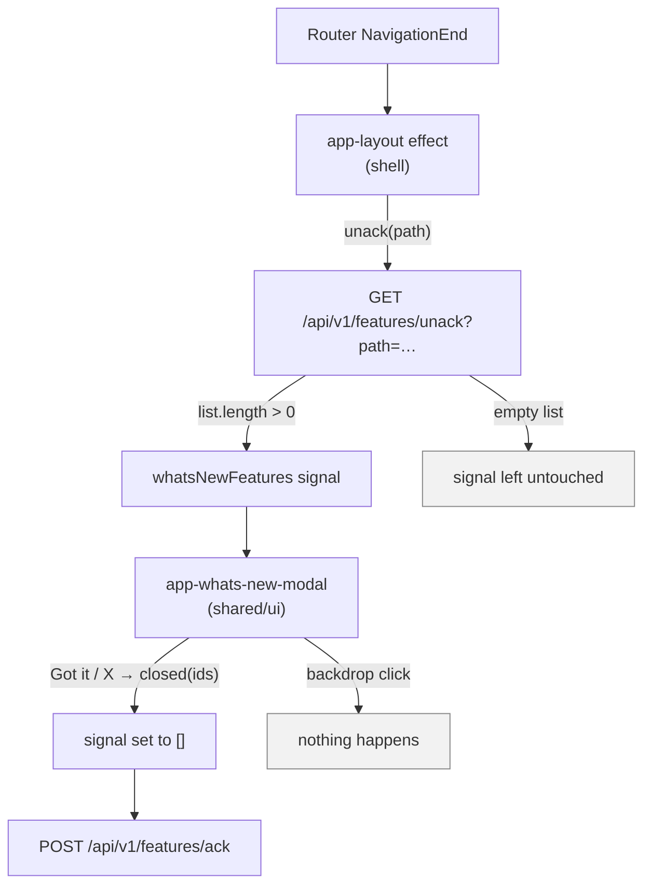

# The "What's new" feature spotlight

A modal that shows a user a newly-shipped feature **exactly once**, the first time they land on
one of the URL prefixes that announcement is bound to. If several announcements are pending at the
same moment, they chain into one carousel rather than stacking as separate popups.

This is a real module you are meant to keep — unlike `libs/feature-items`, it carries no business
domain and there is nothing in it to delete. It spans four libraries, and the split is the usual
one:

| Library | File | Role |
|---|---|---|
| `shared/ui` | `libs/shared/ui/src/lib/whats-new-modal/` | The component. Pure presentation: takes a list in, emits ids out. |
| `data-access/api-client` | `libs/data-access/api-client/src/lib/feature-announcements-api.service.ts` | The gateway. `unack(path)` and `ack(ids)`. |
| `shared/util` | `libs/shared/util/src/lib/language.service.ts` | `pick(en, ar)` — which half of a paired field renders. |
| `shell` | `libs/shell/src/lib/app-layout/app-layout.ts` | The wiring: the per-navigation check and the dismiss handler. |

Two documents sit either side of this one. [`docs/architecture.md`](architecture.md) covers each of
those four files in its library's own section;
[ADR-0005](adr/0005-bespoke-whats-new-modal-as-a-primeng-exception.md) records why the component is
bespoke markup rather than a `p-dialog`.

---

## How it is wired



### The check runs at the shell, on every navigation

`AppLayoutComponent` holds an `effect` that reads a `path()` signal fed by the router's
`NavigationEnd` events. Every time navigation completes and there is a session, it calls
`unack()` with the current path. There is no per-page wiring anywhere, and there is nowhere to add
any.

That placement is the design, not a convenience:

- **Every route is covered by existing.** A page added next month inherits the behaviour without
  opting in — and nobody has to remember to opt it in.
- **One announcement can target several unrelated pages.** The client sends a path; the server
  decides whether that path matches. The scope of an announcement is a server-side property, not a
  decision spread across page components.
- **It follows navigation, not mounting.** Moving between two routes served by the same component
  still fires the check.

`AppLayoutComponent` renders only for the `authGuard`-protected route group, so the check never
runs on the login, callback, or signing-out pages — there is no user to show an announcement to
yet.

### Two details that look like bugs and are not

**The pending list is only ever set to a non-empty value, and is never cleared on success.**

```ts
next: (list) => {
  if (list.length > 0) this.whatsNewFeatures.set(list);
},
```

The missing `else` is deliberate. The request is *not* suppressed while a modal is already open, so
a fast double-navigation can land a newer response carrying nothing pending while the user is still
reading the panel. An unconditional `set` would blank the modal mid-sentence. The signal is cleared
in exactly one place — `onWhatsNewClosed`, on a deliberate dismiss.

**Dismissal clears locally first, then POSTs.**

`onWhatsNewClosed` sets the signal to `[]` *before* calling `ack()`. A failed acknowledgement
therefore still closes the modal; the announcement simply re-surfaces on a later navigation and the
user dismisses it again. A modal that will not go away because a background request failed is a far
worse outcome than one shown twice.

Both the `unack` and `ack` error handlers are empty on purpose. A spotlight is not critical UX, and
a toast complaining about one is noise about something the user never asked for.

### The backdrop is inert

Clicking outside the panel does nothing. `onBackdrop()` is an empty method with a comment telling
you not to "fix" it, and `whats-new-modal.spec.ts` has a test named
*"does NOT dismiss when the backdrop is clicked"*.

The reason is that dismissal is not a UI state change — it writes a permanent, per-user
acknowledgement that follows the user to every device. It has to be a considered action, so only
**Got it** or the close button spend it. This is the one place the app deliberately diverges from
its own dialog convention, and it is why the component is not a `p-dialog` with
`[dismissableMask]="false"`.

### One dismiss acknowledges the whole carousel

`dismiss()` emits **every** id in `features()`, not just the page the user happened to end on:

```ts
dismiss(): void {
  const ids = this.features().map((f) => f.id);
  this.closed.emit(ids);
}
```

So a three-page carousel closed from page three sends one POST with three ids — and so does one
closed from page one via the X. Nothing the user has been shown comes back.

---

## Authoring an announcement

**Shipping an announcement never touches component code.** The body is a light markdown the modal
parses at render time, so the content is data end to end. If you find yourself editing
`whats-new-modal.html` to say something new, stop.

The format has exactly two rules:

| A line that… | Renders as |
|---|---|
| starts with `- ` | a tinted benefit card |
| is anything else non-blank | a centred paragraph |

Blank lines are structural separators and render nothing of their own.

Inside a benefit card:

- **The leading emoji becomes the card icon.** It is matched by the Unicode
  `\p{Extended_Pictographic}` property, not against a hardcoded list — so a glyph nobody
  anticipated still works, and nobody has to extend an allow-list to ship an announcement. A
  bullet line with no emoji falls back to a `•`.
- **The first spaced em-dash (` — `) splits the card title from its description.** Spaces on both
  sides, and it must be an em-dash (`—`), not a hyphen. With no em-dash, the whole line is the
  title and the card renders without a description.
- Cards cycle through five background tints in order, so consecutive rows read as distinct.

A body that exercises both conventions:

```text
Set up a list the way you like it once, then jump straight back to it from the sidebar.

- 🔖 Saved views — pin any combination of filters and sorting under a name you choose
- ⚡ Instant search — results narrow as you type, no page reload in between
- 🌙 Dark mode — follows your system setting automatically, or pick one and stay there
```

That renders as one paragraph above three tinted cards, each with its emoji lifted out into the
icon slot.

### Bilingual copy

`FeatureAnnouncement` carries paired fields: `titleEn`/`titleAr` and `bodyEn`/`bodyAr`. The Arabic
halves are nullable, so an announcement may ship English-only.

`LanguageService.pick(en, ar)` in `shared/util` chooses between them, falling back through the
other language before giving up on `''` — a missing Arabic body renders the English rather than an
empty panel. The modal's own fixed chrome ("What's new", "Got it", "Next", "Previous") goes through
the same `pick` helper, so it cannot drift out of step with the server-supplied copy.

`LanguageService` is deliberately **not** an i18n framework — no catalogues, no plural rules, no
locale-aware formatting. It exists because paired `*En`/`*Ar` API fields need something to choose
between them. If the product needs real localisation, adopt a library and delete the service; do
not grow it.

### Writing the copy itself

[`DESIGN.md`](../DESIGN.md) §9 applies here as it does everywhere: sentence case, verbs on
buttons, no exclamation marks, no "Oops!". A spotlight is the one surface where enthusiasm is
appropriate and also the one where it is most tempting to overdo — the card description should say
what the user can now do, not how pleased the team is.

---

## Previewing it without a backend

`apps/web/src/mocks/handlers.ts` carries **one sample announcement**, so the module is visible in
demo mode with no API at all:

```bash
npx nx serve web --configuration=demo
```

Sign in with any of the role-picker users and the modal appears on the first authenticated route.
Its body deliberately exercises both authoring conventions — a paragraph and three emoji bullet
lines — so the preview shows the parser working rather than a placeholder.

**This is a mock, not seed data.** It lives in the MSW handler array and nowhere else. No rows are
seeded into any database by this repository, and that was an explicit requirement rather than an
oversight: the real announcements are records the API owns, and a boilerplate that quietly inserted
one would be making a product decision on behalf of whoever adopts it.

Two consequences of it being in-memory:

- The acknowledged-id set is per browser session, so **a page reload replays the announcement**.
  That is what makes the demo build deterministic — the same as the item store beside it. The real
  API persists acknowledgement per user, so it survives reloads and other devices.
- `resetAnnouncements()` is exported for tests that need a clean slate.

The mock announcement is returned regardless of the requested path, because it carries no page
restriction. Path matching is the server's job, and the mock does not simulate it. If you need to
see the carousel, add a second entry to `seedAnnouncements()` — the modal switches on
`total() > 1` and grows dots, a counter, and Previous/Next by itself.

---

## What the client expects from the API

Two endpoints, both versioned, both behind the standard `ApiResponse<T>` envelope that
`envelopeInterceptor` unwraps before any of this code sees it.

### `GET /api/v1/features/unack?path=<current-path>`

Returns the announcements that are active, **not yet acknowledged by the calling user**, and whose
registered page prefixes match `path`.

All three filters are the server's responsibility. The client holds no page list, no acknowledgement
state, and no ordering logic — it sends a path and renders what comes back. The service normalises
nothing itself and expects the server to normalise the path before matching, so `..` segments cannot
be used to make an announcement fire on an unrelated route.

Each item:

| Field | Type | Notes |
|---|---|---|
| `id` | `string` | What `ack` sends back. |
| `key` | `string` | Stable machine identifier for whoever authors the announcement. Never shown. |
| `titleEn` | `string` | |
| `titleAr` | `string \| null` | Nullable — English-only announcements are allowed. |
| `bodyEn` | `string` | The light markdown described above. |
| `bodyAr` | `string \| null` | Nullable. |
| `displayOrder` | `number` | Lower shows first when several are pending. **The server sorts**; the client renders the array as received. |
| `createdAt` | `string` | ISO 8601. |

An envelope whose `data` is `null` unwraps to `null`, and the service maps that to `[]` so "nothing
pending" never becomes a null check at the call site.

### `POST /api/v1/features/ack`

Body `{ "featureIds": ["…"] }`, response `204 No Content`.

Must be **idempotent** — ids the user has already acknowledged are skipped silently, because a
double-dismiss is an ordinary event here, not an error. The client does not read the response and
does not surface a failure.

### The temporary type

`FeatureAnnouncement` is declared by hand in `feature-announcements-api.service.ts`. That is the
one documented exception to *"never hand-write an API type"*
([ADR-0002](adr/0002-openapi-generated-frontend-types.md)), and it exists only because this endpoint
is not in the OpenAPI document yet — there is nothing to generate from.

When the API publishes it:

1. `npm run generate:api` (or [`/sync`](../.claude/commands/sync.md)).
2. Delete the local `FeatureAnnouncement` interface.
3. Import it from `@aj-boilerplate/data-access/api-types` instead, and fix the two import sites
   (`app-layout.ts`, `whats-new-modal.ts`) plus the MSW handler.

Left in place, it becomes exactly the duplicate declaration of a server contract that ADR-0002
exists to prevent.

---

## Changing the component

Read [ADR-0005](adr/0005-bespoke-whats-new-modal-as-a-primeng-exception.md) first. The short
version: this is the workspace's **only** sanctioned exception to PrimeNG-only and to token-driven
styling, it is bounded to that one directory, and it does **not** extend to accessibility — the
component carries `role="dialog"`, `aria-modal`, `aria-labelledby`, a labelled close button, and
`role="tab"` / `aria-selected` dots itself, precisely because PrimeNG is not there to supply them.
Anything you add must keep the axe suite green with no rules disabled.

The stylesheet minifies to roughly 7.8 kB against an `anyComponentStyle` budget of 8 kB warning /
10 kB error. There is not much headroom, and the correct response to exceeding it is to cut CSS,
not to raise the budget again.

One known gap, recorded in [`DESIGN.md`](../DESIGN.md) §8: the component's seven keyframe
animations do not yet honour `prefers-reduced-motion`. That is a defect in the component, not a
permitted variation — a `@media (prefers-reduced-motion: reduce)` block is outstanding work.

`whats-new-modal.spec.ts` covers the accessibility wiring, the carousel, the inert backdrop, the
one-POST-acknowledges-all rule, and every branch of the body parser. It is the file to extend
before changing behaviour, and it is where the intent of the odd-looking decisions above is pinned
down.

---

## Related

[`docs/architecture.md`](architecture.md) ·
[ADR-0005](adr/0005-bespoke-whats-new-modal-as-a-primeng-exception.md) ·
[ADR-0002](adr/0002-openapi-generated-frontend-types.md) ·
[`DESIGN.md`](../DESIGN.md) ·
[`libs/shared/ui/README.md`](../libs/shared/ui/README.md) ·
[`docs/api/README.md`](api/README.md)
