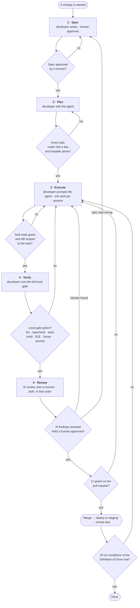
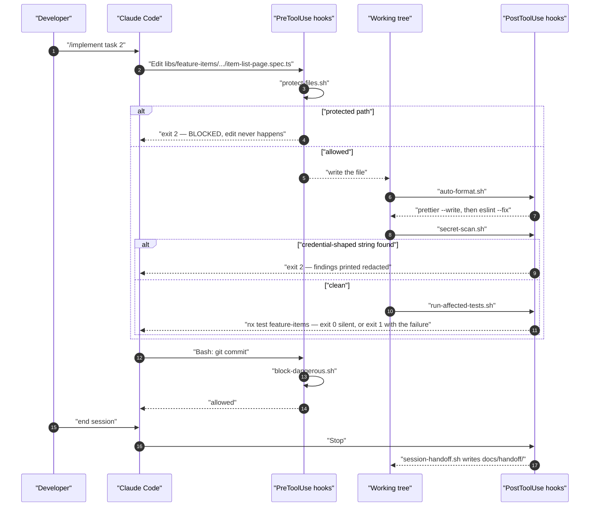
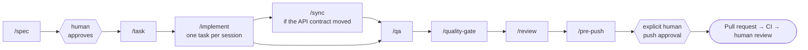
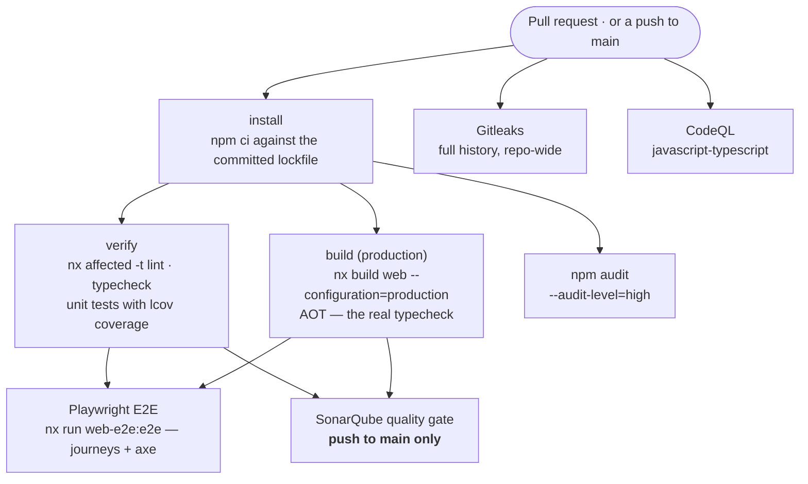

# The five-stage workflow

Every change — a bug fix, a feature, a refactor — moves through the same five stages:

**Spec → Plan → Execute → Verify → Review**

The stages exist to put the thinking before the typing and the checking before the merging. They
are proportional: a one-line fix spends thirty seconds in Spec and Plan, not thirty minutes. What
is *not* proportional is skipping Verify or Review — those are fixed costs on every change.

This document has three parts:

1. **[The process](#the-process-at-a-glance)** — the five stages, who owns each, and where work
   loops back.
2. **[The agentic harness](#the-agentic-harness)** — how `.claude/` participates: which command
   starts each stage, which agent does the work, which hooks fire, and which gates are
   deterministic rather than a matter of judgement.
3. **[A worked example](#worked-example-adding-a-last-updated-column-to-the-item-list)** — one
   small feature followed through all five stages, with the commands you actually type and the
   output you actually get back. Each stage below ends with its slice of that example.

For the library-by-library map of what you are changing, read
[architecture.md](architecture.md) alongside this, and [../CLAUDE.md](../CLAUDE.md) for the
conventions every one of those libraries obeys.

---

## The process at a glance



Note where the loops go. A failing gate sends you back to **Execute**, not forward with a
follow-up ticket. A review finding that the *spec* was wrong sends you all the way back to
**Spec** — that is the cheap outcome, not the embarrassing one.

| Stage | Owner | Command | Output |
|---|---|---|---|
| 1 · Spec | developer, approved by a human reviewer | `/spec` | `docs/specs/YYYY-MM-DD-<slug>.md`, status `Approved` |
| 2 · Plan | developer, with the agent | `/task` | an ordered task list, each ≤ half a day |
| 3 · Execute | developer, prompting the agent | `/implement` | working code with tests, committed |
| 4 · Verify | developer | `/qa`, then `/pre-push` | a green local gate, with pasted evidence |
| 5 · Review | an AI reviewer **and** a human | `/review`, then a human | an approved, merged pull request |

---

## The agentic harness

`.claude/` ships committed, not gitignored, so every developer and every agent gets the same
rules. It has four kinds of thing in it, and the difference between them is the whole point of the
design:

```mermaid
flowchart LR
  subgraph P["PROBABILISTIC — judgement, may vary run to run"]
    STD["standards/ · 12 files<br/>what good looks like"]
    CMD["commands/ · 8 slash commands<br/>the procedure to follow"]
    AGT["agents/ · 7 subagents<br/>who does which kind of work"]
    WF["workflows/ · 5 procedures<br/>the long-form reasoning"]
    TPL["templates/ · 3 starting points"]
  end

  subgraph D["DETERMINISTIC — fires every time, identical every time"]
    HOOK["hooks/ · 8 shell scripts<br/>exit 2 blocks the tool call"]
    PERM["settings.json permissions<br/>deny · ask · allow"]
    CI["GitHub Actions<br/>frontend-ci.yml"]
    BND["Nx module boundaries<br/>lint fails on a sideways import"]
  end

  P -. "prose an agent may misread,<br/>skip, or rationalise around" .-> D
  D --> OUT(["What actually reaches main"])
```



**Everything on the left is advice.** A standard is a document; an agent reads it, usually follows
it, and occasionally does not. That is not a defect of this repository — it is what a language
model is. Prose scales the *quality* of the default behaviour; it cannot be the last line of
defence.

**Everything on the right fires regardless.** A hook is a shell script the harness executes; it
does not read the room, get tired, or decide the rule does not apply this time. A CI job either
passes or does not. `@nx/enforce-module-boundaries` reads the actual dependency graph, so a
feature library importing another feature library fails `nx lint` no matter how good the reason
sounded in the prompt.

The design rule that follows, quoted from [`.claude/README.md`](../.claude/README.md): *"If it is
worth enforcing deterministically, it belongs in a hook, not only in prose. A rule a machine can
check should not depend on an agent remembering it."*

### The hooks, and exactly when they fire

Eight hooks are wired in [`.claude/settings.json`](../.claude/settings.json). They degrade
gracefully when a tool is missing and are safe to run by hand.

| Hook | Event | Blocks? | What it does |
|---|---|:--:|---|
| [`model-routing.sh`](../.claude/hooks/model-routing.sh) | UserPromptSubmit — **every prompt** | never | Injects the [model-routing policy](../.claude/model-routing.md) straight into context. `UserPromptSubmit` stdout is one of the few hook outputs the model actually reads, so this turns a linked markdown file from advisory into something said out loud on every turn. Dependency-free; always exits 0. |
| [`block-dangerous.sh`](../.claude/hooks/block-dangerous.sh) | PreToolUse `Bash` | **yes — exit 2** | Refuses `rm -rf`, `git push --force`, `git reset --hard`, `git clean -fdx`, history rewriting, production cloud operations, infrastructure `apply`/`destroy`, and credential-exfiltration shapes. **No bypass variable exists.** |
| [`sonar-pre-push.sh`](../.claude/hooks/sonar-pre-push.sh) | PreToolUse `Bash`, only when the command is a `git push` | **yes — exit 2** | Queries the SonarQube quality gate and the open Blocker/Critical/Major list. Blocks while any is open, printing them. **Fails closed**: unreachable or unconfigured means the gate has not passed. |
| [`protect-files.sh`](../.claude/hooks/protect-files.sh) | PreToolUse `Edit`\|`Write`\|`MultiEdit`\|`NotebookEdit` | **yes — exit 2** | Refuses edits to `.env*` (templates excepted), key material (`*.pem`, `*.p12`, `*.pfx`, `*.key`, service-account JSON), and `.claude/settings.json` itself. **No bypass variable exists.** |
| [`auto-format.sh`](../.claude/hooks/auto-format.sh) | PostToolUse `Edit`\|`Write`\|… | no | Formats **only** the file just edited: `.ts/.html/.css/.scss/.json/.md` → Prettier, plus `eslint --fix` for TypeScript. Runs from the nearest `package.json` so the workspace's own config wins. A missing tool is a skip, never an error. |
| [`secret-scan.sh`](../.claude/hooks/secret-scan.sh) | PostToolUse `Edit`\|`Write`\|… (and usable as a git pre-commit hook) | **yes — exit 2** | Gitleaks on the changed file when installed, **plus** a built-in pattern set that always runs — PEM blocks, cloud keys, GitHub/Slack/Sonar tokens, JWTs, and connection strings carrying a password. Findings print redacted. |
| [`run-affected-tests.sh`](../.claude/hooks/run-affected-tests.sh) | PostToolUse `Edit`\|`Write`\|… | no — exit 1 on failure | Runs `nx test <project>` for the Nx project that owns the edited `.ts` file, immediately. **Never exits 2** — it surfaces a failure as a warning without cancelling the edit. Silent when nothing is affected, and skips generated paths such as `libs/data-access/api-types`. |
| [`session-handoff.sh`](../.claude/hooks/session-handoff.sh) | Stop | never | Writes `docs/handoff/<date>-<session>.md` from `git status` and `git diff --stat` — no model call — and flags when `CLAUDE.md`, `docs/adr/`, or the OpenAPI snapshot look stale relative to what changed. Reports only. |

Here is one ordinary edit, end to end:



Three details worth internalising. First, a **PreToolUse** hook can stop the tool call before it
happens; a **PostToolUse** hook can only react to something that already happened. That is why
`protect-files.sh` guards paths (prevention) while `secret-scan.sh` scans content (detection) —
and why a secret finding is an incident, not a warning: the value already reached a file, so it is
compromised and must be rotated. Second, `run-affected-tests.sh` deliberately never blocks. A red
test during TDD is the *expected* state; a hook that cancelled the edit would make test-first
impossible. Third, that hook only fires for TypeScript — edit a `.html` template and Prettier runs
but no test does, so **run the project's tests yourself after a template-only change**.

### The permission layer

[`.claude/settings.json`](../.claude/settings.json) also carries a three-tier permission policy,
which is deterministic in the same way:

- **`deny`** — never, no prompt: `rm -rf`, any force push, `git reset --hard`, `git clean -fdx`,
  history rewriting, `kubectl delete`, infrastructure `apply`/`destroy`, reading `.env*` /
  `*.pem` / `*.pfx` / `~/.ssh/**` / cloud credential directories, and editing `.env*` or
  `.claude/settings.json`.
- **`ask`** — always prompts a human: `git push`, `gh pr create`, `gh pr merge`, `gcloud`, `az`,
  `npm publish`.
- **`allow`** — no prompt, because they are safe and constant: `npm ci` / `npm install` /
  `npm run *` / `npm audit`, `npx nx *`, `npx prettier`, `npx eslint`, `gitleaks`, read-only git
  plus `add`/`commit`/`branch`/`switch`/`stash`, and ordinary file inspection.

Note that `git push` appears in **`ask`** *and* is separately gated by `sonar-pre-push.sh`. Those
are two independent controls: the hook decides whether the code has passed the gate, the permission
prompt decides whether a human has agreed to publish it. The full policy, including what "explicit
approval" means, is in
[`standards/git-approval-policy.md`](../.claude/standards/git-approval-policy.md).

### Which agent does what

Seven subagent definitions live in `.claude/agents/`. They are prose — descriptions of a role and
the standards it must apply — so an agent is a way of *loading the right context*, not a sandbox.

| Agent | Stage it serves | Role |
|---|---|---|
| [`master-agent`](../.claude/agents/master-agent.md) | all | Orchestrator: plans, routes to specialists, enforces the non-negotiables |
| [`frontend-agent`](../.claude/agents/frontend-agent.md) / [`frontend-engineer`](../.claude/agents/frontend-engineer.md) | 3 | Angular, Nx, PrimeNG, standalone + signals + `inject()`, generated types |
| [`test-engineer`](../.claude/agents/test-engineer.md) | 3 | Vitest component tests, Playwright journeys, axe accessibility scans |
| [`code-reviewer`](../.claude/agents/code-reviewer.md) | 5 | Reviews the diff against library boundaries, standards, correctness, security |
| [`security-auditor`](../.claude/agents/security-auditor.md) | 5 | OWASP baseline, SSO and token handling, capability-not-role UI, secrets, XSS surface |
| [`quality-gate`](../.claude/agents/quality-gate.md) | 4 | Runs lint, typecheck, test, build and SonarQube and certifies readiness; never pushes |

### Which command starts each stage



**No command in this harness pushes.** [`/qa`](../.claude/commands/qa.md),
[`/quality-gate`](../.claude/commands/quality-gate.md), [`/review`](../.claude/commands/review.md),
and [`/pre-push`](../.claude/commands/pre-push.md) all end by reporting and stopping. Pushing is a
decision a human makes, every time, on every branch and every remote.

### The CI gates

CI is the second deterministic layer, and it does not care what any agent believed. The whole of
it is [`.github/workflows/frontend-ci.yml`](../.github/workflows/frontend-ci.yml), and the jobs
are these:



The ordering is "fastest failure first": lint and unit tests fall over in a minute, the production
build in a few, Playwright last. `verify` uses `nx affected` (with `nrwl/nx-set-shas` computing the
base) so a change to one library does not re-run the whole workspace; the Sonar job uses
`run-many` instead, because an analysis has to cover the whole project or the coverage numbers lie.

Every gate runs on pull requests **except the SonarQube job, which is guarded to `push` on `main`
only.** That guard is a Community Build consequence, explained
[below](#a-note-on-sonarqube-community-build).

### A note on SonarQube: Community Build

The SonarQube used here is the free **Community Build**. That has a specific, load-bearing
consequence:

> **Community Build has no pull-request decoration and no branch analysis.** It analyses one
> branch — the project's default branch — and that is all. There will be no Sonar comment on your
> pull request, no per-branch quality gate, and no "new code on this branch" view.

What that means in practice:

- **The CI quality gate is a main-branch gate.** The Sonar job is guarded to run only on a `push`
  to `main`, precisely because every Community Build analysis lands on the project's single
  default branch — scanning from a pull request would overwrite the dashboard with code that is
  not on `main`. Treat it as the post-merge check that the trunk is still healthy, not as
  something that can block your PR the way a decorated gate would.
- **Never pass a branch or a pull request to the scanner or to the MCP server.** No
  `sonar.branch.name`, no `sonar.pullrequest.*` argument in CI, and no `branch` or `pullRequest`
  argument on a SonarQube MCP call. Those need Developer Edition or above; on Community Build the
  default-branch analysis *is* the analysis.
- **TypeScript needs only the generic scanner.** The JS/TS analyser ships with Community Build, so
  CI runs `sonarqube-scan-action` directly over `apps` and `libs`, importing
  `coverage/*/lcov.info` produced by `nx run-many -t test --coverage`. There is no build wrapper to
  configure.
- **The local gate is where Sonar actually protects you.** `/qa`, `/quality-gate`, `/pre-push`,
  and the `sonar-pre-push.sh` hook all run before anything leaves your machine. `sonar-pre-push.sh`
  fails closed — an unreachable or unconfigured server counts as "not passed" — so the enforcement
  is real even without PR decoration.
- **Do not promise decoration in a PR template or a runbook.** If you later move to an edition that
  supports branch analysis, add it deliberately; until then, the honest description is the one
  above.
- The gate's own thresholds are unchanged either way: **zero new Blocker, Critical, or Major
  findings**, and **≥80% coverage on new code**. Minor and Info may be triaged, with the triage
  recorded.

Configuration lives in `SONAR_HOST_URL`, `SONAR_TOKEN`, and `SONAR_PROJECT_KEY` — environment
variables locally; in CI, the `SONAR_HOST_URL` and `SONAR_PROJECT_KEY_FRONTEND` repository
variables and the `SONAR_TOKEN` secret. Never committed. The rules in full:
[`standards/sonarqube.md`](../.claude/standards/sonarqube.md).

---

## Worked example: adding a Last updated column to the item list

One small, realistic change followed through all five stages. It is deliberately unglamorous: the
item list already loads `ItemResponse.updatedAt` from the API and then throws it away, so the
column that would answer "when did this last change?" is missing. We add it.

It is a good first exercise precisely because it touches nothing but the frontend and yet still
crosses every layer this workspace has: the contract types, a feature component and its template,
the offline mock, and a journey — with an accessibility scan on top.

Every command below is real, every path exists in this repository, and you can run the whole
thing on a clean clone.

---

## Stage 1 — Spec

**Owner:** the developer, reviewed and approved by the tech lead
**Output:** `docs/specs/YYYY-MM-DD-<slug>.md`, status `Approved`
**Command:** `/spec`
**Hooks that fire:** `protect-files.sh` (Pre), `auto-format.sh` + `secret-scan.sh` (Post) on the
spec file itself

Write down the problem, the acceptance criteria as Given/When/Then, the API contract the change
depends on, the UI states, the test plan, and — explicitly — what is out of scope. Use
[the template](specs/TEMPLATE.md); keep every heading, and write "None" where a section genuinely
does not apply so a reader can tell *considered and empty* from *forgotten*.

[`/spec`](../.claude/commands/spec.md) will ask the questions that change the design before it
starts drafting — the actor, the trigger, the data, the rules, what happens when it fails. Answer
them. Then it stops: **a spec is approved by a human, not by the agent that wrote it.**

Because this repository owns no database and no API, the contract section answers a different
question from the one you may be used to: *what must the upstream API already expose for this to
be buildable?* If the answer is "something it does not expose yet", the spec is blocked on an API
change — raise it with the API team, and once it ships, re-run
[`/sync`](../.claude/commands/sync.md) (`npm run generate:api`) so the generated types carry the
new shape. A frontend spec never invents a field.

Nothing is built until the spec is approved. This is the cheapest stage to be wrong in, and the
only one where being wrong costs nothing.

**Done when:** a second person can read the spec and independently describe what will be built,
and every open question in §8 is closed.

### Worked example — Stage 1

You type:

```
/spec item-last-updated-column
```

The agent asks the load-bearing questions ("does the API already return it?", "what do you show
when it is null?", "is the column sortable, and can the server actually sort?"), then writes
`docs/specs/2026-08-11-item-last-updated-column.md`. Trimmed to the sections that carry the
decisions:

```markdown
# Spec: Last updated column on the item list

**Status:** Approved
**Author:** <you>
**Reviewer:** <a human, always>

## 1. Problem statement

**Today:** the item list shows Name, Description, Status and Created. `updatedAt` is fetched with
every row and discarded, so a user comparing two items cannot tell which one moved most recently
without opening both.

**Success looks like:** the list carries a Last updated column, formatted like the Created column,
and honest about items that have never been edited.

## 2. Acceptance criteria

| # | Criterion |
|---|---|
| AC-1 | **Given** an item whose `updatedAt` is set **When** a user opens `/items` **Then** the row shows it in the Last updated column, formatted as `02 Feb 2026, 10:15` |
| AC-2 | **Given** an item whose `updatedAt` is `null` **When** the row renders **Then** the cell shows an em dash — never a blank cell, and never `Invalid Date` |
| AC-3 | **Given** the list is server-paged **When** the header renders **Then** it is a plain `<th scope="col">` with no sort control, because `onLazyLoad` does not forward a sort field to the API and a header that promises an ordering it cannot deliver is a lie |
| AC-4 | **Given** an editor saves a change **When** they return to the list **Then** that row's Last updated shows the new value with no manual refresh (the `['items']` query is already invalidated after a save) |
| AC-5 | **Given** the accessibility suite **When** it scans `/items` **Then** it still reports zero violations |

## 3. API contract

**No API change.** This feature is buildable only because the contract already carries the field:

| Endpoint | Shape | Field relied on |
|---|---|---|
| `GET /api/v1/items` | `PagedResponse<ItemResponse>` | `updatedAt: string \| null` — ISO-8601, `null` until first update |
| `GET /api/v1/items/{id}` | `ItemResponse` | as above (unused here) |

Verified in `libs/data-access/api-types/src/lib/types.ts` (generated) and returned by the offline
handlers in `apps/web/src/mocks/handlers.ts`. No new request field, no new query parameter, no new
endpoint, no version bump — so no `/sync` is required. **Had the field been missing, this spec
would be blocked**: the frontend would not add it locally, it would be raised with the API team and
`npm run generate:api` re-run once shipped.

## 4. UI states

| State | Behaviour |
|---|---|
| Loading | Unchanged — the table's own skeleton covers the new column |
| Error | Unchanged — the existing inline error block with a retry |
| Empty | Unchanged — `app-empty-state` |
| Success | Five data columns; the new one right of Created |

## 7. Out of scope

- Sorting or filtering by `updatedAt` (needs a server-side sort parameter first).
- Showing *who* updated the item — the contract has no such field.
- Relative times ("3 days ago").
```

The human reviewer approves it. Only now does Stage 2 start.

---

## Stage 2 — Plan

**Owner:** the developer, with the agent
**Output:** an ordered task list, each task independently testable and mergeable
**Command:** `/task <path-to-approved-spec>`

Break the spec into tasks. A good task is one sitting's work, has an observable outcome, and can
be verified on its own. If a task cannot be tested independently, it is two tasks or it is
underspecified. [`/task`](../.claude/commands/task.md) refuses to run against a spec that has not
been approved.

Two rules it enforces:

1. **Each task is at most half a day.** Oversized tasks produce oversized diffs, and oversized
   diffs are not reviewed, they are skimmed.
2. **Each task is independently mergeable.** It builds, its tests pass, and merging it alone
   leaves `main` working.

And one ordering, which is the order that keeps the tree green at every step:

> **Contract check → generated types → data-access → shared/ui → feature component → template →
> MSW handlers → E2E journey and axe**

It is the workspace's own dependency direction — `app → feature → shared`, with
`data-access/api-types` upstream of everything — walked from the outside in. Anything that cannot
be placed in that order is a signal the spec is incomplete, or that you are about to import
sideways and fail `nx lint`.

Decide here what needs an ADR. If the plan contains a decision that is expensive to reverse, write
the ADR now — not after the code makes the decision for you. Use
[the ADR template](adr/TEMPLATE.md) and read [the existing ones](adr/README.md) first.

**Done when:** the task list is ordered, each task names the tests that will prove it, and the
estimated diff for each is small enough to review.

### Worked example — Stage 2

You type:

```
/task docs/specs/2026-08-11-item-last-updated-column.md
```

You get back five tasks in the prescribed order. Every path is written in full, relative to the
repository root, so it can be copied straight into an editor:

**1 · Confirm the contract already carries `updatedAt`** — depends on nothing.
`libs/data-access/api-types/src/lib/types.ts` (read only — the file is generated)
→ `npm run generate:api` when an API is running, then `npm run typecheck`

**2 · Write the failing component test for the column** — depends on nothing.
`libs/feature-items/src/lib/item-list-page/item-list-page.spec.ts`
→ `npx nx test feature-items` — expected to **fail**

**3 · Render the column** — depends on tasks 1 and 2.
`libs/feature-items/src/lib/item-list-page/item-list-page.html`
→ `npx nx test feature-items` and `npx nx lint feature-items`

**4 · Give the offline demo data a distinguishable updated time** — depends on task 3.
`apps/web/src/mocks/handlers.ts`
→ `npx nx build web --configuration=demo`, then eyeball `npx nx serve web --configuration=demo`

**5 · Extend the journey and keep the axe scan green** — depends on task 4.
`apps/web-e2e/src/journeys/items-crud.spec.ts`
→ `npx nx e2e web-e2e`

Note tasks 1 and 2 have no dependencies, so they can run in parallel. Note also that task 4 comes
*after* the UI: until the column renders there is nothing for better mock data to prove, and the
`demo` fixtures exist to serve the tests, not the other way round. No ADR is needed here — nothing
about this change is expensive to reverse.

---

## Stage 3 — Execute

**Owner:** the developer, prompting the agent
**Output:** working code with tests, committed
**Command:** `/implement <task>`
**Hooks that fire on every edit:** `protect-files.sh` before; `auto-format.sh`, `secret-scan.sh`,
`run-affected-tests.sh` after

**Test first, always.** Write the failing test. Watch it fail — a test that has never failed has
not been shown to test anything. Then write the minimum code that makes it pass. Then refactor
with the test green.

One task per session. Fresh context for each task. When a task is done, the session ends.

[`/implement`](../.claude/commands/implement.md) works on a branch, never `main`, and finishes by
summarising what it did, what it verified **with the actual command output**, and what is still
open. It does not push.

**Done when:** the task's tests pass, the affected suites still pass, and the diff contains
nothing the task did not require.

### Worked example — Stage 3

Take **task 2**, the failing test. Start a fresh session:

```
/implement task 2 from docs/specs/2026-08-11-item-last-updated-column.md — assert the Last updated column
```

**First, the failing test.** The agent adds to
`libs/feature-items/src/lib/item-list-page/item-list-page.spec.ts`, reusing the `ITEM`,
`renderList` and `paged` helpers already at the top of that file:

```ts
it('shows when each item was last updated', async () => {
  await renderList({ list: () => of(paged([{ ...ITEM, updatedAt: '2026-02-02T10:15:00Z' }])) });

  expect(await screen.findByRole('columnheader', { name: 'Last updated' })).toBeTruthy();
  expect(screen.getByText('02 Feb 2026, 10:15')).toBeTruthy();
});

it('shows an em dash for an item that has never been updated', async () => {
  await renderList({ list: () => of(paged([{ ...ITEM, updatedAt: null }])) });

  const row = await screen.findByTestId('item-row');
  expect(within(row).getAllByText('—')).toHaveLength(1);
});
```

`auto-format.sh` fires the moment the file is written: Prettier, then `eslint --fix` because it is
a `.ts` file. `secret-scan.sh` fires next and passes silently. `run-affected-tests.sh` fires last
and runs the owning Nx project:

```
$ npx nx test feature-items

 FAIL  src/lib/item-list-page/item-list-page.spec.ts > shows when each item was last updated
 TestingLibraryElementError: Unable to find role="columnheader" and name "Last updated"

 Test Files  1 failed | 1 passed (2)
      Tests  1 failed | 12 passed (13)
```

Good — it fails, and it fails for the right reason. This is the state a hook must not cancel,
which is exactly why `run-affected-tests.sh` exits 1 rather than 2.

**Then task 3, the implementation.** `item-list-page.html` gains one header cell and one body
cell. The component needs no change at all: `formatWhen()` already wraps `formatDateTime()` from
`@aj-boilerplate/shared/util`, and that helper already returns an em dash for `null`.

```html
<!-- in the header template, right of Created -->
<th scope="col">Last updated</th>

<!-- in the body template, right of the created cell -->
<td>{{ formatWhen(item.updatedAt) }}</td>
```

Two harness details show up here, and both are worth knowing before they surprise you:

- `auto-format.sh` runs Prettier on the `.html` file but **not** `eslint --fix` — that is
  TypeScript-only.
- `run-affected-tests.sh` does not fire at all for a template. It matches `.ts` files. So run the
  suite yourself; a template-only change is exactly the one nobody notices is untested.

```
$ npx nx test feature-items

 Test Files  2 passed (2)
      Tests  13 passed (13)
```

Thirteen, because `feature-items` ships with eleven and you added two.

**Then task 4, the offline mock.** The demo seed in `apps/web/src/mocks/handlers.ts` currently sets
`updatedAt` to the *same* instant as `createdAt`, so the two columns would render identically and
the new one would prove nothing. Give the updated rows a later time:

```ts
// in seed(), replacing `updatedAt: i % 4 === 0 ? null : created`
updatedAt: i % 4 === 0 ? null : new Date(Date.UTC(2026, 1, 1 + i, 16, 30, 0)).toISOString(),
```

That file *is* TypeScript and *is* inside the `web` project, so `run-affected-tests.sh` fires
`nx test web` on save. Then look at it for real, because a column is a visual thing:

```bash
npx nx serve web --configuration=demo   # MSW-backed, no API needed
```

One thing the harness will stop you doing here, deterministically: hand-editing
`libs/data-access/api-types/src/lib/types.ts` to "add" a field the API does not return. It is a
generated file — `npm run generate:api` overwrites it wholesale, `run-affected-tests.sh` skips it
on purpose, and the review will ask why the OpenAPI document disagrees with it. If you need a
shape the API does not expose, change the API. See
[ADR 0002](adr/0002-openapi-generated-frontend-types.md).

**Then task 5, the journey and the scan.** Extend the existing CRUD journey in
`apps/web-e2e/src/journeys/items-crud.spec.ts` rather than adding a sixth spec — the behaviour
belongs to the journey that already creates and edits an item:

```ts
// after the list assertion
await expect(page.getByRole('columnheader', { name: 'Last updated' })).toBeVisible();

// after the edit is saved and the list has been searched down to one row (AC-4)
await expect(page.getByTestId('item-row').first()).not.toContainText('—');
```

```bash
npx nx e2e web-e2e
```

That target boots the `demo` build and runs both journeys plus the four axe scans in
`apps/web-e2e/src/accessibility/critical-routes.spec.ts`. The `/items` scan is the one that proves
AC-5: a `<th>` without `scope="col"` is exactly the kind of regression it catches, and no rule is
disabled to make it pass.

Commit after each task. `git commit` is on the **`allow`** list, so it does not prompt —
committing is routine, publishing is not.

---

## Stage 4 — Verify

**Owner:** the developer
**Output:** a green local gate, with evidence
**Commands:** `/qa`, then `/pre-push`

Run the full gate locally before asking anyone else to look at the work:

- Lint, including the Nx module-boundary rules — a warning is a failure.
- Typecheck, and the production build, which is the AOT typecheck of every template.
- Unit tests across the workspace, with coverage.
- Playwright journeys and the axe scans, if a user journey or a screen changed.
- The dependency audit and the secret scan.
- The quality gate: zero new Blocker, Critical, or Major findings; ≥80% coverage on new code.

Paste the evidence into the pull request. "It works" is not evidence; the command output is.

If the gate is red, it is not "nearly done". It is not done.

**Done when:** every gate is green locally and the output is in the pull request.

### Worked example — Stage 4

You type `/qa`. It runs the workspace gate, then the secret scan, then Sonar, and prints each
step's **real** result rather than a summary of what it expected. By hand, the same sequence is:

```bash
# --- the workspace gate ---------------------------------------------------
npm ci
npx nx run-many -t lint --all
npm run typecheck
npx nx run-many -t test --all
npx nx build web --configuration=production
npx nx e2e web-e2e                # a journey changed, so this runs
npm audit --audit-level=high

# --- secrets --------------------------------------------------------------
gitleaks detect --no-banner --redact
```

Mid-loop, while you are still iterating, the faster equivalent is
`npx nx affected -t lint,test,build` — it runs only the projects your diff can have broken, which
is what CI's `verify` job does too. Run the `--all` form once before you open the pull request:
"affected" is only as honest as the base commit it was given.

What you should see. The counts below are the suites **as this repository ships**, so you can run
these commands on a clean clone right now and compare — your own totals will be these plus whatever
tests your change added:

```
✔ All files pass linting                                   (nx run-many -t lint --all, 6 projects)

Tests  32 passed (util)          Tests  23 passed (api-client)
Tests  35 passed (auth)          Tests  26 passed (ui)
Tests   3 passed (shell)         Tests  11 passed (feature-items)
Tests  14 passed (web)
NX  Successfully ran target test for 8 projects            → 144 tests in 21 files

Application bundle generation complete.                    (nx build web --configuration=production)

  6 passed                                                 (Playwright: 2 journeys + 4 accessibility scans)

no leaks found                                             (Gitleaks)
```

The lint run is not a formatting check with extra steps: it is also where
`@nx/enforce-module-boundaries` refuses a `feature → feature` or `shared → feature` import. If it
ever fails that way, the fix is to move the shared thing into `libs/shared/*`, not to relax the
constraint in `eslint.config.mjs`. The reasoning is in
[architecture.md](architecture.md) and [`standards/angular.md`](../.claude/standards/angular.md).

Then `/pre-push`. It re-checks the tree is committed, re-runs the gate, reads the SonarQube result
through the SonarQube MCP server (`get_project_quality_gate_status`, then
`search_sonar_issues_in_projects` filtered to `BLOCKER,CRITICAL,MAJOR`, then
`search_security_hotspots` — and never with a `branch` or `pullRequest` argument), and confirms the
documentation caught up with the code — the OpenAPI snapshot in [`docs/api/`](api/README.md), any
new ADR, and [`CLAUDE.md`](../CLAUDE.md) if a convention changed.

```
Quality gate: OK
Open Blocker/Critical/Major: 0
Coverage on new code: 91.4%
Readiness: green — push requires your explicit approval.
```

Remember what that gate is and is not: with **Community Build** there is no branch analysis, so
this reads the project's default-branch analysis. The local run is where it protects you. If you
now try to push before that gate is green, `sonar-pre-push.sh` blocks the `git push` outright:

```
BLOCKED by .claude/hooks/sonar-pre-push.sh

3 open Blocker/Critical/Major issue(s) on project "your-project-key".
Every one of them must be fixed before this push.
```

And if SonarQube is simply not running, it still blocks — the gate fails closed, because "could
not evaluate" is not "passed".

---

## Stage 5 — Review

**Owner:** an AI reviewer *and* a human reviewer — both, in that order
**Output:** an approved, merged pull request
**Commands:** `/review`, then a human

`/review` first: it reads `git diff` and `git diff --staged` — the diff, not its memory of what it
intended to write — checks the change against the spec, walks the checklist in
[`.claude/workflows/code-review.md`](../.claude/workflows/code-review.md), and cross-checks the
standards for [Angular and PrimeNG usage](../.claude/standards/angular.md),
[TypeScript strictness](../.claude/standards/typescript.md),
[the response envelope](../.claude/standards/api-response-format.md),
[endpoint versioning](../.claude/standards/api-versioning.md),
[error handling](../.claude/standards/error-handling.md),
[input validation and sanitization](../.claude/standards/input-validation-sanitization.md),
[OWASP](../.claude/standards/owasp-security.md), and
[test coverage of every new behaviour, error path, and empty state](../.claude/standards/testing.md).
It outputs prioritised findings with `file:line`, each marked **blocker** or **nit**. Fix what it
finds before a human spends time on it.

Then a human reviews every line. Not a skim, not a rubber stamp.

**Human review is mandatory and is never waived because an agent wrote the code.** If anything,
agent-written code needs *more* attention: it is fluent, confident, plausible, and consistently
formatted, which makes a wrong approach look exactly like a right one. Reviewers should be most
careful precisely where the code reads most smoothly.

Read [the Definition of Done](definition-of-done.md) before approving. All six conditions, or it
does not merge.

**Done when:** both reviews are approved, the Definition of Done is met, and there are no open
critical or major findings.

### Worked example — Stage 5

You type `/review`. On this change it might come back with:

```
BLOCKER  libs/feature-items/src/lib/item-list-page/item-list-page.html:95
         The new header was copied from its neighbours and carries
         pSortableColumn="updatedAt", but the table is [lazy]="true" and onLazyLoad
         (item-list-page.ts:154) reads only `first` and `rows` — it never forwards
         event.sortField. Clicking the header therefore re-orders the current page only,
         while the pager still walks the server's unchanged order. AC-3 says a plain
         <th scope="col">. Remove pSortableColumn, or add a sort parameter to the API
         first and send it.

BLOCKER  apps/web-e2e/src/journeys/items-crud.spec.ts:31
         The journey asserts the column exists but never asserts a value, so AC-4 — the
         row's Last updated refreshing after a save — has no coverage at any level. Assert
         the edited row's cell after the save, on the searched-down single row.

NIT      libs/feature-items/src/lib/item-list-page/item-list-page.spec.ts:118
         screen.getByText('—') would also match the Description column, which renders the
         same em dash for a null description — the test can pass for the wrong cell. Scope
         it: within(await screen.findByTestId('item-row')).getAllByText('—').
```

You fix the two blockers, re-run `/qa`, and open the pull request. The body follows
[`.claude/templates/pull-request.md`](../.claude/templates/pull-request.md), which is a checklist
rather than a narrative:

- **Summary** — what changed and why, linking `docs/specs/2026-08-11-item-last-updated-column.md`
- **Changes** — the libraries and apps touched (`libs/feature-items`, `apps/web`, `apps/web-e2e`),
  and whether the generated types moved (here: no, the field already existed)
- **Quality gate** — a checkbox per command, with the pasted output: `nx run-many -t lint --all`
  clean, `npm run typecheck` clean, `nx run-many -t test --all` green, the production build clean
  with no warnings, Playwright green and axe clean on the changed screen, `npm audit` clean,
  SonarQube at zero Blocker/Critical/Major with ≥80% coverage on new code, Gitleaks clean
- **Architecture & standards** — Nx boundaries respected (`app → feature → shared`, nothing
  sideways); standalone + `OnPush` + signals + `inject()`; PrimeNG only, no native controls;
  no hand-written HTTP client and no re-declared DTO; no `any`; component still under 300 lines
- **API contract** — versioned route, envelope unwrapped centrally, generated types untouched
  because the contract did not move (and regenerated and committed when it does)
- **Accessibility & states** — all four view states still handled; the new header keyed with
  `scope="col"`; keyboard navigation unchanged; the axe scan green
- **Security** — capability-driven UI only, never a permission implemented by hiding a button; no
  `innerHTML` with user content; no secrets and no real identifiers in fixtures
- **Notes / risks** — what a reviewer should look at hardest

Then, and only then, you ask for push approval. `git push` prompts because it is on the **`ask`**
list; `sonar-pre-push.sh` runs first and either lets it through or blocks it.

**What the human reviewer owns**, and no tool can do for them:

- **Is this the right change at all?** The gate proves the code is well-formed; it says nothing
  about whether the feature should exist.
- **Does it match the spec, including the non-goals?** Scope creep is invisible to a linter.
- **Are the tests testing anything?** An assertion that agrees with whatever the code does is not
  a test. Ask whether each one was ever seen failing.
- **Does the UI still behave in the states nobody wrote a test for** — a slow network, a stale
  cache, a narrow viewport, a keyboard-only user?
- **Can the author explain every line?** If not, it does not merge — see the guardrail below.

The human review is also where a wrong *spec* gets caught, which loops the change all the way back
to Stage 1. That is the cheapest place this can end.

---

## Guardrails

These are not suggestions. They exist because each one has a specific failure it prevents.

### One task per session, fresh context per task

Long sessions accumulate stale context: superseded decisions, abandoned approaches, half-finished
edits. The agent then reasons from a mix of what is true and what used to be true. Start each
task clean.

### Test-driven, genuinely

The failing test comes first and you watch it fail. This is the difference between testing your
code and writing code that agrees with your test. It matters more with an agent, not less — an
agent asked for code and tests together will produce tests that pass against whatever it wrote.

### No unattended multi-hour runs

Never leave an agent running unsupervised for hours. Without a human in the loop, a small wrong
turn compounds into a large one, and by the time you look the diff is unreviewable and the
context that produced it is gone. Stay present, review at each task boundary.

### Roughly 400 changed lines per pull request

A reviewer's attention is finite and measurable, and it falls off a cliff well before a
thousand-line diff. Above roughly 400 changed lines, review quality degrades into
pattern-matching. Split the work. Generated files (`libs/data-access/api-types`) are excluded from
the count — but they are still reviewed, because a diff there means a contract moved.

### The prompting developer owns the code

You wrote it. Not the agent — you. You are accountable for its correctness, its security, its
performance, and its maintenance. "The AI generated it" explains nothing and excuses nothing. If
you cannot explain a line in review, it does not merge.

### Never push without explicit human approval

Committing is routine. Pushing is a decision a human makes, every time, on every branch and
every remote. This is enforced twice: `git push` sits in the `ask` list in
[`.claude/settings.json`](../.claude/settings.json), and `sonar-pre-push.sh` independently blocks
the push until the gate is green.

### Secrets never enter context

No credential, token, or key in a prompt, a file, a commit message, a spec, or an ADR. Ever. That
includes anything you paste into an environment file or a fixture. Rotate anything that leaks.
`secret-scan.sh` catches what it can, but treat a finding as an incident rather than a warning:
the value already reached a file. See [`standards/security.md`](../.claude/standards/security.md).

### Documentation moves with the change

If a convention changed, [`CLAUDE.md`](../CLAUDE.md) changes in the same pull request. If a
decision was made, an ADR lands with it. If a contract changed, the OpenAPI document and the
generated types change with it. Documentation that lags is documentation that misleads.
`session-handoff.sh` flags this drift at the end of every session — do not ignore its report.

### Improve the harness, not just the code

Once a week, look at where an agent got it wrong and ask the only question that matters: *what
change would have prevented this?* Then pick exactly one home for the fix — `CLAUDE.md` or a
standard if it did not know the rule, a command workflow if it skipped a step, an agent
description if the wrong specialist was used, **a hook if the thing should have been impossible**.
The full practice is written up in [`.claude/README.md`](../.claude/README.md). Prefer a hook to a
paragraph: prose is advisory, a hook is deterministic.

---

## Commands

| Command | Stage | What it does |
|---|---|---|
| [`/spec`](../.claude/commands/spec.md) | 1 | Start a spec from the template; stops for human approval |
| [`/task`](../.claude/commands/task.md) | 2 | Break an approved spec into ≤half-day, independently-mergeable tasks |
| [`/implement`](../.claude/commands/implement.md) | 3 | Implement one task, test-first, on a branch |
| [`/sync`](../.claude/commands/sync.md) | 3 | Regenerate API types from OpenAPI and check for duplicated DTOs and unversioned calls |
| [`/qa`](../.claude/commands/qa.md) | 4 | The full local gate |
| [`/quality-gate`](../.claude/commands/quality-gate.md) | 4 | Static analysis only, enforcing zero Blocker/Critical/Major |
| [`/pre-push`](../.claude/commands/pre-push.md) | 4 | The gate plus a readiness report — never pushes |
| [`/review`](../.claude/commands/review.md) | 5 | AI review of the diff |

Each has a longer-form procedure behind it in `.claude/workflows/` — read the workflow when you
want the reasoning, run the command when you want the work done:
[new-feature](../.claude/workflows/new-feature.md),
[api-change](../.claude/workflows/api-change.md),
[code-review](../.claude/workflows/code-review.md),
[pre-push-quality-gate](../.claude/workflows/pre-push-quality-gate.md),
[release](../.claude/workflows/release.md).

---

## Where to look next

| Topic | Path |
|---|---|
| What each library is for, and why the boundaries exist | [architecture.md](architecture.md) |
| What the product should look and feel like | [../DESIGN.md](../DESIGN.md) |
| The conventions every component obeys | [../CLAUDE.md](../CLAUDE.md) |
| What this repository is, in one page | [../README.md](../README.md) |
| What "done" means — all six conditions | [definition-of-done.md](definition-of-done.md) |
| Day-1 checklist | [onboarding.md](onboarding.md) |
| The spec template | [specs/TEMPLATE.md](specs/TEMPLATE.md) |
| Why each decision was made | [adr/README.md](adr/README.md) |
| The API contract procedure | [api/README.md](api/README.md) |
| A new component, from the template | [../.claude/templates/angular-component.md](../.claude/templates/angular-component.md) |
| Session handoffs written by the Stop hook | [handoff/README.md](handoff/README.md) |
| The harness in full — hooks, agents, standards, escape hatches | [../.claude/README.md](../.claude/README.md) |
